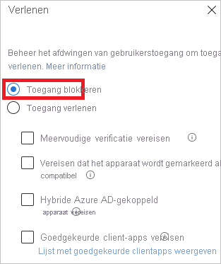
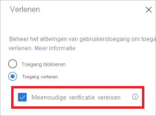

# Wat is de diagnostische aanmelding in azure AD?

Azure Active Directory (Azure AD) biedt u een flexibel beveiligings model om te bepalen wat gebruikers kunnen doen met beheerde resources. De toegang tot deze resources wordt niet alleen bepaald door *wie* ze zijn, maar ook *door de* toegang tot deze bronnen. Normaal gesp roken bevat een flexibel model een zekere mate van complexiteit vanwege het aantal configuratie opties dat u hebt. Complexiteit kan het risico op fouten verhogen.

Als IT-beheerder hebt u een oplossing nodig waarmee u inzicht krijgt in de activiteiten in uw systeem. Met deze zicht baarheid kunt u problemen vaststellen en oplossen wanneer deze zich voordoen. De diagnostische aanmelding voor Azure AD is een voor beeld van een dergelijke oplossing. U kunt de diagnose gebruiken om te analyseren wat er is gebeurd tijdens een aanmeldings poging en aanbevelingen te krijgen voor het oplossen van problemen zonder dat hiervoor micro soft-ondersteuning nodig is.

In dit artikel vindt u een overzicht van wat de oplossing doet, en hoe u deze kunt gebruiken.

## Vereisten

De diagnostische aanmeldingsgegevens zijn beschikbaar in alle edities van Azure AD.

U moet een globale beheerder zijn in Azure AD om deze functie te kunnen gebruiken.

## Uitleg

In azure AD is het antwoord op een aanmeldings poging gekoppeld aan *wie* zich aanmeldt en *hoe* ze toegang krijgen tot de Tenant. Een beheerder kan bijvoorbeeld doorgaans alle aspecten van de Tenant configureren wanneer deze zich aanmeldt bij het bedrijfs netwerk. Maar dezelfde gebruiker kan worden geblokkeerd wanneer deze zich aanmeldt met hetzelfde account van een niet-vertrouwd netwerk.

Als gevolg van de grotere flexibiliteit van het systeem om te reageren op een aanmeldingspoging, kan het gebeuren dat u problemen met aanmelden moet oplossen. Met diagnostische aanmeldingsgegevens kunt u:

- Analyseert gegevens van aanmeldings gebeurtenissen.

- Hiermee wordt weer gegeven wat er is gebeurd.

- Bevat aanbevelingen voor het oplossen van problemen.

Diagnostische aanmeldingsgegevens voor Azure AD zijn ontworpen om zelf een diagnose uit te voeren wanneer zich fouten voordoen tijdens het aanmelden. Om het diagnostische proces te voltooien, moet u het volgende doen:

1. Definieer het bereik van de aanmeldings gebeurtenissen die u vindt.

2. Selecteer de aanmelding die u wilt controleren.

3. Bekijk de diagnostische resultaten.

4. Actie ondernemen.

### Bereik definiëren

Het doel van deze stap is het definiëren van het bereik van de aanmeldings gebeurtenissen die moeten worden onderzocht. Uw bereik is gebaseerd op een gebruiker of op een id (correlationId, aanvraag nummer) en een tijds bereik. Als u het bereik verder wilt beperken, kunt u een app-naam opgeven. In Azure AD worden de bereikgegevens gebruikt om de juiste gebeurtenissen voor u te vinden.  

### Aanmelding selecteren  

Op basis van uw zoek criteria haalt Azure AD alle overeenkomende aanmeldings gebeurtenissen op en geeft deze weer in een lijst weergave met verificatie samenvatting.

U kunt de kolommen aanpassen die in deze weergave te zien zijn.

### Diagnose beoordelen

Voor de geselecteerde aanmeldings gebeurtenis biedt Azure AD u de diagnostische resultaten.

Deze resultaten beginnen met een evaluatie, waarin wordt uitgelegd wat er in een paar zinnen is gebeurd. De uitleg helpt u om het gedrag van het systeem te begrijpen.

Vervolgens krijgt u een overzicht van de bijbehorende beleids regels voor voorwaardelijke toegang die zijn toegepast op de geselecteerde aanmeldings gebeurtenis. De diagnostische resultaten bevatten ook aanbevolen herstel stappen om het probleem op te lossen. Omdat het niet altijd mogelijk is om problemen op te lossen zonder meer hulp, is het mogelijk dat een aanbevolen stap een ondersteunings ticket opent.

### Actie ondernemen

Hier aangekomen beschikt u, als het goed is, over de benodigde informatie om het probleem op te lossen.

## Scenario's

De volgende scenario's vallen onder de diagnostische aanmelding:

- Geblokkeerd op basis van beleid voor voorwaardelijke toegang

- Mislukte vanwege voorwaardelijke toegang

- Multi-factor Authentication (MFA) van voorwaardelijke toegang

- MFA vanwege andere vereisten

- Proof-up voor MFA is vereist

- MFA-proef afdruk vereist (Risk ante locatie van aanmelding)

- Geslaagde aanmelding

### Geblokkeerd op basis van beleid voor voorwaardelijke toegang

In dit scenario is een aanmeldings poging geblokkeerd door een beleid voor voorwaardelijke toegang.

De sectie diagnostische gegevens voor dit scenario bevat details over de aanmeldings gebeurtenis van de gebruiker en de toegepaste beleids regels.

### Mislukte vanwege voorwaardelijke toegang

Dit scenario is doorgaans het gevolg van een aanmeldings poging die is mislukt, omdat niet aan de vereisten van een beleid voor voorwaardelijke toegang is voldaan. Enkele typische voorbeelden:

- Hybride Azure AD-gekoppeld apparaat vereisen

- Goedgekeurde client-apps vereisen

- Beleid voor app-beveiliging vereisen

De sectie diagnostische gegevens voor dit scenario bevat details over de aanmeldings poging van gebruikers en de toegepaste beleids regels.

### MFA vanwege voorwaardelijke toegang

In dit scenario heeft een beleid voor voorwaardelijke toegang de vereiste om zich aan te melden met multi-factor Authentication set.

De sectie diagnostische gegevens voor dit scenario bevat details over de aanmeldings poging van gebruikers en de toegepaste beleids regels.

### MFA vanwege andere vereisten

In dit scenario wordt een multi-factor Authentication-vereiste niet afgedwongen door een beleid voor voorwaardelijke toegang. Multi-factor Authentication is bijvoorbeeld per gebruiker.

De intentie van dit diagnostische scenario is om meer details te bieden over:

- De bron van de multi-factor Authentication-interrupt
- Het resultaat van de client interactie

U kunt ook alle details van de aanmeldings poging van de gebruiker weer geven.

### Proof-up voor MFA is vereist

In dit scenario werden aanmeldings pogingen onderbroken door aanvragen voor het instellen van multi-factor Authentication. Deze instelling staat ook bekend als proef afdruk.

Het controle programma voor meervoudige verificatie vindt plaats wanneer een gebruiker is verplicht multi-factor Authentication te gebruiken, maar nog niet is geconfigureerd, of een beheerder de gebruiker heeft verplicht om deze te configureren.

Het doel van dit diagnostische scenario is om aan te tonen dat de multi-factor Authentication-onderbreking is veroorzaakt door een gebrek aan gebruikers configuratie. De aanbevolen oplossing is dat de gebruiker de proef afdruk kan volt ooien.

### MFA-proef afdruk vereist (Risk ante locatie van aanmelding)

In dit scenario werden aanmeldings pogingen onderbroken door een aanvraag om multi-factor Authentication in te stellen op basis van een Risk ante aanmeldings locatie.

Het doel van dit diagnostische scenario is om aan te tonen dat de multi-factor Authentication-onderbreking is veroorzaakt door een gebrek aan gebruikers configuratie. De aanbevolen oplossing is dat de gebruiker de proef afdruk kan volt ooien, specifiek vanaf een netwerk locatie die niet riskant is.

Als een bedrijfs netwerk bijvoorbeeld is gedefinieerd als een benoemde locatie, moet de gebruiker in plaats daarvan proberen om de controle uit te voeren vanaf het bedrijfs netwerk.

### Geslaagde aanmelding

In dit scenario worden aanmeldings gebeurtenissen niet onderbroken door voorwaardelijke toegang of multi-factor Authentication.

Dit diagnostische scenario bevat details over gebruikers aanmeld gebeurtenissen die naar verwachting worden onderbroken vanwege beleid voor voorwaardelijke toegang of multi-factor Authentication.

## Volgende stappen

- [Wat zijn Azure Active Directory-rapporten?](overview-reports.md)
- [Wat is Azure Active Directory-controle?](overview-monitoring.md)
