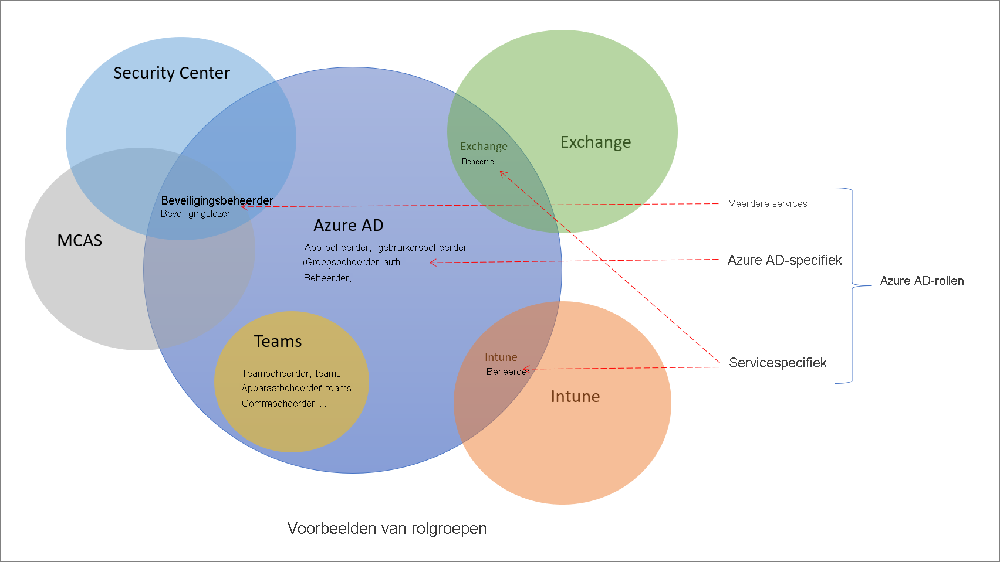

# Rollen in Azure Active Directory begrijpen

Er zijn ongeveer 60 ingebouwde Azure Active Directory-rollen (Azure AD), wat rollen met een vaste set rolmachtigingen zijn. Voor een aanvulling op de ingebouwde rollen biedt Azure AD ook ondersteuning voor aangepaste rollen. Gebruik aangepaste rollen om de gewenste rolmachtigingen te selecteren. U kunt bijvoorbeeld een account maken om bepaalde Azure AD-resources, zoals toepassingen of service-principals, te beheren.

In dit artikel wordt uitgelegd wat Azure AD-rollen zijn en hoe ze kunnen worden gebruikt.

## Hoe verschillen Azure AD-functies van andere Microsoft 365-rollen?

Er zijn veel verschillende services in Microsoft 365, zoals Azure AD en Intune. Sommige van deze services hebben hun eigen op rollen gebaseerde toegangsbeheersystemen, namelijk:

- Azure AD
- Exchange
- Intune
- Security Center
- Nalevingscentrum
- Microsoft Cloud App Security
- Handel

Andere services, zoals Teams, SharePoint en Managed Desktop, hebben geen afzonderlijke op rollen gebaseerd toegangsbeheersysteem. Ze gebruiken Azure AD-rollen voor hun beheertoegang. Azure heeft een eigen op rollen gebaseerd toegangsbeheersysteem voor Azure-resources, zoals virtuele machines, en dit systeem is niet hetzelfde als Azure AD-rollen.

Wanneer we afzonderlijk op rollen gebaseerd toegangsbeheersysteem zeggen, betekent dit dat er een ander gegevensarchief is waar de roldefinities en roltoewijzingen worden opgeslagen. Ook is er een ander beslissingspunt waar toegangscontroles plaatsvinden. Zie [Rollen voor Microsoft 365-services in Azure AD](m365-workload-docs.md) en [Klassieke abonnementbeheerdersrollen, Azure-rollen en Azure AD-rollen](../../role-based-access-control/rbac-and-directory-admin-roles.md) voor meer informatie.

## Waarom sommige Azure AD-rollen voor andere services zijn

Microsoft 365 heeft een aantal op rollen gebaseerde toegangsbeheersystemen die onafhankelijk zijn ontwikkeld gedurende een bepaalde periode, elk met een eigen serviceportal. Om het voor u handig te maken identiteiten te beheren in Microsoft 365 via de Azure AD-portal, hebben we enkele servicespecifieke ingebouwde rollen toegevoegd, die alle beheertoegang bieden tot een Microsoft 365-service. Een voorbeeld hiervan is de rol van Exchange-beheerder in Azure AD. Deze rol is gelijk aan de [Organisatiebeheer-rolgroep](/exchange/organization-management-exchange-2013-help) in het op rollen gebaseerd toegangsbeheer van Exchange en kan alle aspecten van Exchange beheren. Evenzo hebben we de rol van Intune-beheerder, Teams-beheerder, SharePoint-beheerder, enzovoort toegevoegd. Serverspecifieke rollen vormen één categorie van ingebouwde rollen van Azure AD in de volgende sectie.

## Categorieën van Azure AD-rollen

De ingebouwde rollen van Azure AD verschillen in waar ze kunnen worden gebruikt, en vallen in de volgende drie algemene categorieën.

- **Azure AD-specifieke rollen**: deze rollen verlenen alleen binnen Azure AD machtigingen voor het beheren van resources. Gebruikersbeheerder, toepassingsbeheerder en groepsbeheerder verlenen bijvoorbeeld alle machtigingen voor het beheren van resources die zich in Azure AD bevinden.
- **Servicespecifieke rollen:** Voor belangrijke Microsoft 365-services (niet-Azure AD) hebben we servicespecifieke rollen ontwikkeld die machtigingen verlenen voor het beheren van alle functies in de service.  De rollen Exchange-beheerder, Intune-beheerder, SharePoint-beheerder en Teams-beheerder kunnen bijvoorbeeld functies met hun respectieve services beheren. De Exchange-beheerder kan postvakken beheren, de Intune-beheerder kan apparaatbeleid beheren, de SharePoint-beheerder kan siteverzamelingen beheren, de Teams-beheerder kan de gesprekskwaliteit beheren, enzovoort.
- **Rollen voor meerdere services**: Er zijn enkele rollen die meerdere services omvatten. We hebben twee globale rollen: globale beheerder en globale lezer. Deze twee rollen gelden voor alle Microsoft 365-services. Er zijn ook enkele beveiligingsrollen, zoals beveiligingsbeheerder en beveiligingslezer, die toegang verlenen tot meerdere beveiligingsservices binnen Microsoft 365. U kunt bijvoorbeeld de rol van beveiligingsbeheerder in Azure AD gebruiken om Microsoft 365 Security Center, Microsoft Defender Advanced Threat Protection en Microsoft Cloud App Security te beheren. Op dezelfde manier kunt u met de rol van beheerder voor naleving instellingen beheren in Microsoft 365 Beheerder voor naleving, Exchange, enzovoort.

De volgende tabel fungeert als een hulpmiddel bij het begrijpen van deze rolcategorieën. De categorieën worden willekeurig benoemd en zijn niet bedoeld om andere mogelijkheden te impliceren dan de [gedocumenteerde rolmachtigingen](permissions-reference.md).

Categorie | Rol
---- | ----
Azure AD-specifieke rollen | Toepassingsbeheerder Toepassingsontwikkelaar Verificatiebeheerder Beheerder van B2C IEF-sleutelset Beheerder van B2C IEF-beleid Beheerder van de cloudtoepassing Cloudapparaatbeheerder Beheerder van voorwaardelijke toegang Apparaatbeheerders Lezers van mappen Adreslijstsynchronisatieaccounts Adreslijstschrijvers Beheerder van externe id-gebruikersstromen Beheerder van externe id-gebruikersstroomkenmerken Beheerder van externe id-providers Groepsbeheerder Afzender van gastuitnodigingen Helpdeskbeheerder Hybrid Identity-beheerder Licentiebeheerder Laag1-ondersteuning voor partner Laag2-ondersteuning voor partner Wachtwoordbeheerder Bevoorrechte verificatiebeheerder Beheerder voor bevoorrechte rollen Rapportenlezer Gebruikersaccountbeheerder
Rollen voor meerdere services | Hoofdbeheerder Beheerder voor naleving Beheerder voor nalevingsgegevens Algemene lezer Beveiligingsbeheer Beveiligingsoperator Beveiligingslezer Serviceondersteuningsbeheerder
Servicespecifieke rollen | Azure DevOps-beheerder Azure Information Protection-beheerder Factureringsbeheerder CRM-servicebeheerder Toegangsfiatteur voor Klanten-lockbox Desktop Analytics-beheerder Exchange-servicebeheerder Insights-beheerder Insights-bedrijfsleider Intune-servicebeheerder Kaizala-beheerder Lync Service-beheerder Berichtencentrum-privacylezer Berichtencentrum-lezer Moderne Commerce-gebruiker Netwerkbeheerder Beheerder van Office-apps Power BI-servicebeheerder Power Platform-beheerder Printerbeheerder Printertechnicus Zoekbeheerder Zoekredacteur SharePoint-servicebeheerder Teams-communicatiebeheerder Ondersteuningstechnicus voor Teams-communicatie Ondersteuningsspecialist voor Teams-communicatie Teams-apparaatbeheerder Teams-servicebeheerder

## Volgende stappen

- [Overzicht van op rollen gebaseerd toegangsbeheer van Azure AD](custom-overview.md)
- Roltoewijzingen maken met behulp van [Azure Portal, Azure AD PowerShell en Graph API](custom-create.md)
- [De toewijzingen voor een rol bekijken](custom-view-assignments.md)
