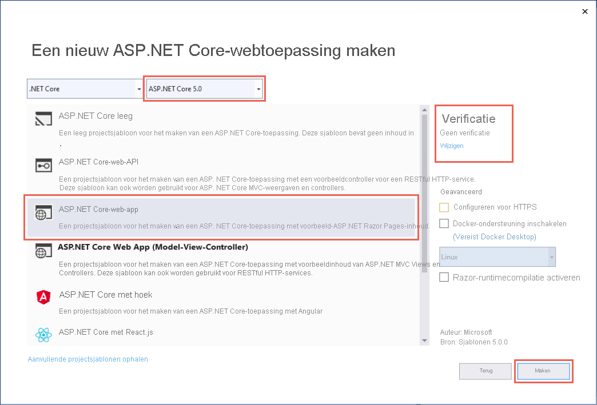
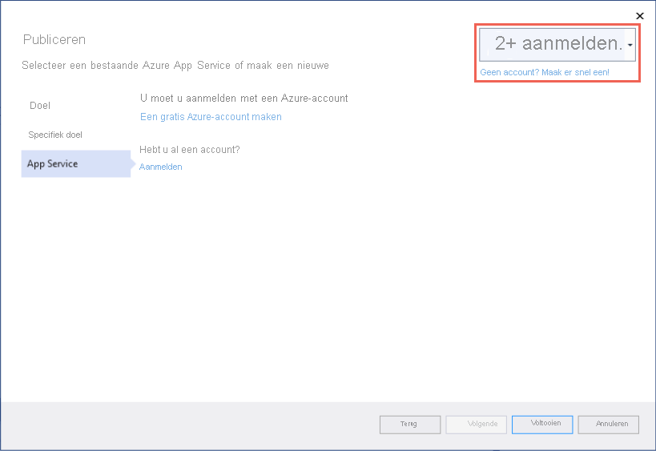
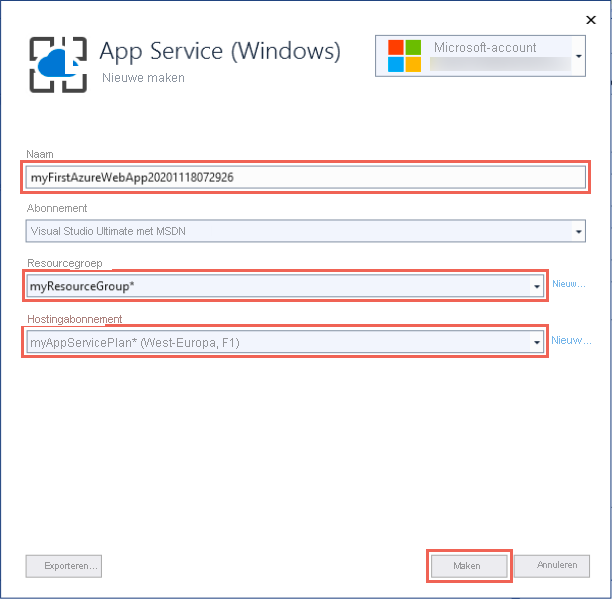

# <a name="quickstart-create-an-aspnet-core-web-app-in-azure"></a>Quickstart: Een ASP.NET Core-web-app maken in Azure

::: zone pivot="platform-windows"  

In deze quickstart leert u hoe u uw eerste ASP.NET Core-web-app maakt en implementeert in [Azure App Service](overview.md). App Service ondersteunt .NET 5.0-apps.

Als u klaar bent, beschikt u over een Azure-resourcegroep die bestaat uit een App Service-hostingabonnement en een Azure Service-app met een geïmplementeerde webtoepassing.

## <a name="prerequisites"></a>Vereisten

- Een Azure-account met een actief abonnement. [Gratis een account maken](https://azure.microsoft.com/free/dotnet/)
- U moet <a href="https://www.visualstudio.com/downloads/" target="_blank">Visual Studio 2019</a> met de **ASP.NET- en webontwikkelworkload** installeren.

  Als u Visual Studio 2019 al hebt geïnstalleerd:

  - Installeer de nieuwste updates in Visual Studio door **Help** > **Controleren op updates** te selecteren. De meest recente updates bevatten de .NET 5,0 SDK.
  - Voeg de workload toe door **Hulpprogramma's** > **Hulpprogramma's en functies ophalen** te selecteren.


## <a name="create-an-aspnet-core-web-app"></a>Een ASP.NET Core-web-app maken

Maak een ASP.NET Core-web-app in Visual Studio door deze stappen te volgen:

# <a name="net-core-31"></a>[.NET Core 3.1](#tab/netcore31)

1. Open Visual Studio en selecteer **Een nieuw project maken**.

1. Selecteer in **Een nieuw project maken** de **ASP.NET Core-webtoepassing**, en controleer of **C#** wordt vermeld in de talen voor deze keuze. Selecteer vervolgens **Volgende**.

1. Geef in **Uw nieuwe project configureren** het webtoepassingsproject de naam *myFirstAzureWebApp*, en selecteer **Maken**.

   

1. U kunt elk type ASP.NET Core-web-app implementeren in Azure, maar voor deze quickstart kiest u de sjabloon **Webtoepassing**. Zorg ervoor dat **Verificatie** is ingesteld op **Geen verificatie** en dat er geen andere optie is geselecteerd. Ten slotte selecteert u **Create**.

    
   
1. Selecteer in het menu van Visual Studio de optie **Foutopsporing** > **Starten zonder foutopsporing** om de web-app lokaal uit te voeren.

   

# <a name="net-50"></a>[.NET 5.0](#tab/net50)

1. Open Visual Studio en selecteer **Een nieuw project maken**.

1. Selecteer in **Een nieuw project maken** de **ASP.NET Core-webtoepassing**, en controleer of **C#** wordt vermeld in de talen voor deze keuze. Selecteer vervolgens **Volgende**.

1. Geef in **Uw nieuwe project configureren** het webtoepassingsproject de naam *myFirstAzureWebApp*, en selecteer **Maken**.

   

1. Voor een .NET 5.0-app selecteert u **ASP.NET Core 5.0** in de vervolgkeuzelijst.

1. U kunt elk type ASP.NET Core-web-app implementeren in Azure, maar voor deze quickstart kiest u de sjabloon **ASP.NET Core Web App**. Zorg ervoor dat **Verificatie** is ingesteld op **Geen verificatie** en dat er geen andere optie is geselecteerd. Ten slotte selecteert u **Create**.

    
   
1. Selecteer in het menu van Visual Studio de optie **Foutopsporing** > **Starten zonder foutopsporing** om de web-app lokaal uit te voeren.

   

---

## <a name="publish-your-web-app"></a>Uw web-app publiceren

Als u de web-app wilt publiceren, moet u eerst een nieuwe App Service maken en configureren waarin u de app kunt publiceren. 

Als onderdeel van het instellen van de App Service maakt u het volgende:

- Een nieuwe [resource groep](../azure-resource-manager/management/overview.md#terminology) die alle Azure-resources voor de service bevat.
- Een nieuw [Hostingabonnement](./overview-hosting-plans.md) dat de locatie, grootte en functies opgeeft van de webserverfarm die als host fungeert voor de app.

Volg deze stappen om de App Service te maken en uw web-app te publiceren:

1. Klik in **Solution Explorer** met de rechtermuisknop op het project **myFirstAzureWebApp** en selecteer **Publiceren**. 

1. Selecteer bij **Publiceren** de optie **Azure** en klik op **Volgende**.

1. Uw opties zijn afhankelijk van het feit of u al bent aangemeld bij Azure en of u een Visual Studio-account hebt gekoppeld aan een Azure-account. Selecteer **Een account toevoegen** of **Aanmelden** om u aan te melden bij uw Azure-abonnement. Als u al bent aangemeld, selecteert u het gewenste account.

   

1. Klik rechts van **App Service-exemplaren** op **+** .

   

1. Accepteer bij **Abonnement** het abonnement dat wordt vermeld, of selecteer een nieuw abonnement in de vervolgkeuzelijst.

1. Selecteer in **Resourcegroep** de optie **Nieuw**. Voer bij **Naam van nieuwe resourcegroep** in: *myResourceGroup*. Selecteer vervolgens **OK**. 

1. Selecteer bij **Hostingabonnement** de optie **Nieuw**. 

1. Voer in het dialoogvenster **Hostingabonnement: Nieuw hostingabonnement maken** de waarden in die zijn opgegeven in de volgende tabel:

   | Instelling  | Voorgestelde waarde | Beschrijving |
   | -------- | --------------- | ----------- |
   | **Hostingabonnement**  | *myFirstAzureWebAppPlan* | De naam van het App Service-plan. |
   | **Locatie**      | *Europa -west* | Het datacenter waar de web-app wordt gehost. |
   | **Grootte**          | *Gratis* | De [prijscategorie](https://azure.microsoft.com/pricing/details/app-service/?ref=microsoft.com&utm_source=microsoft.com&utm_medium=docs&utm_campaign=visualstudio) bepaalt de hosting-functies. |
   
   

1. Voer bij **Naam** een unieke app-naam in die alleen deze geldige tekens bevat: `a-z`, `A-Z`, `0-9` en `-`. U kunt de automatisch gegenereerde unieke naam accepteren. De URL van de web-app is `http://<app-name>.azurewebsites.net`, waarbij `<app-name>` de naam van uw app is.

2. Selecteer **Maken** om de Azure-resources te maken.

   

   Zodra de wizard is voltooid, worden de Azure-resources gemaakt en bent u klaar om te publiceren.

3. Klik op **Voltooien** om de wizard te sluiten.

1. Klik op de pagina **Publiceren** op **Publiceren**. Visual Studio maakt, verpakt en publiceert de app naar Azure. Daarna wordt de app gestart in de standaardbrowser.

   

**Gefeliciteerd!** De ASP.NET-web-app wordt live uitgevoerd in Azure App Service.

## <a name="update-the-app-and-redeploy"></a>De app bijwerken en opnieuw implementeren

Volg deze stappen om uw web-app bij te werken en opnieuw te implementeren:

1. Open in **Solution Explorer**, onder uw project, achtereenvolgens **Pagina’s** > **Index.cshtml**.

1. Vervang de hele tag `<div>` door de volgende code:

   ```html
   <div class="jumbotron">
       <h1>ASP.NET in Azure!</h1>
       <p class="lead">This is a simple app that we've built that demonstrates how to deploy a .NET app to Azure App Service.</p>
   </div>
   ```

1. Als u opnieuw wilt implementeren naar Azure, klikt u in **Solution Explorer** met de rechtermuisknop op het project **myFirstAzureWebApp** en selecteert u **Publiceren**.

1. Selecteer op de samenvattingspagina **Publiceren** de optie **Publiceren**.

   <!--  -->

    Als het publiceren is voltooid, start Visual Studio een browser waarin de URL van de web-app wordt geladen.

    

## <a name="manage-the-azure-app"></a>De Azure-app beheren

Als u de web-app wilt beheren, gaat u naar de [Azure-portal](https://portal.azure.com) en selecteert u **App Services**.


Selecteer op de pagina **App Services** de naam van uw web-app.

:::image type="content" source="./media/quickstart-dotnetcore/select-app-service.png" alt-text="Schermopname van de App Services-pagina waarop een voorbeeldweb-app is geselecteerd.":::

De **Overzichtspagina** voor de web-app bevat opties voor basisbeheer, zoals browsen, stoppen, starten, opnieuw starten en verwijderen. Het linkermenu bevat een meer pagina's voor het configureren van uw app.


[!INCLUDE [Clean-up section](../../includes/clean-up-section-portal.md)]

## <a name="next-steps"></a>Volgende stappen

In deze quickstart hebt u Visual Studio gebruikt om een ASP.NET Core-webtoepassing te maken en implementeren in Azure App Service.

Ga door met het volgende artikel om te leren hoe u een .NET Core-app maakt en deze verbindt met een SQL-database:

> [!div class="nextstepaction"]
> [ASP.NET Core met SQL Database](tutorial-dotnetcore-sqldb-app.md)

> [!div class="nextstepaction"]
> [ASP.NET Core-app configureren](configure-language-dotnetcore.md)

::: zone-end  

::: zone pivot="platform-linux"
[App Service onder Linux](overview.md#app-service-on-linux) biedt een uiterst schaalbare webhostingservice met self-patchfunctie onder het Linux-besturingssysteem. Deze quickstart laat zien hoe u een [.NET Core](/aspnet/core/)-app maakt in App Service on Linux. U maakt de app via de [Azure CLI](/cli/azure/get-started-with-azure-cli) en gebruikt Git om de .NET Core-code in de app te implementeren.


U kunt de stappen in dit artikel volgen met behulp van een Mac-, Windows- of Linux-computer.

[!INCLUDE [quickstarts-free-trial-note](../../includes/quickstarts-free-trial-note.md)]

## <a name="set-up-your-initial-environment"></a>Uw eerste omgeving instellen

# <a name="net-core-31"></a>[.NET Core 3.1](#tab/netcore31)

Dit zijn de vereisten voor het voltooien van deze snelstart:

* <a href="https://dotnet.microsoft.com/download/dotnet-core/3.1" target="_blank">Installeer de nieuwste versie van .NET Core 3.1 SDK</a>.
* <a href="/cli/azure/install-azure-cli" target="_blank">Installeer de nieuwste Azure CLI</a>.

# <a name="net-50"></a>[.NET 5.0](#tab/net50)

Dit zijn de vereisten voor het voltooien van deze snelstart:

* <a href="https://dotnet.microsoft.com/download/dotnet/5.0" target="_blank">Installeer de nieuwste versie van .NET 5.0 SDK</a>.
* <a href="/cli/azure/install-azure-cli" target="_blank">Installeer de nieuwste Azure CLI</a>.

---

[Ondervindt u problemen? Laat het ons weten.](https://aka.ms/DotNetAppServiceLinuxQuickStart)

## <a name="create-the-app-locally"></a>De app lokaal maken

Maak in een terminalvenster op uw computer een map met de naam `hellodotnetcore` en wijzig de huidige map in die map.

```bash
mkdir hellodotnetcore
cd hellodotnetcore
```

Een nieuwe .NET Core-app maken

```bash
dotnet new web
```

## <a name="run-the-app-locally"></a>De app lokaal uitvoeren

Voer de toepassing lokaal uit zodat u kunt zien hoe deze eruit ziet wanneer u de toepassing implementeert naar Azure. 

```bash
dotnet run
```

Open een webbrowser en navigeer naar de app op `http://localhost:5000`.

Het bericht **Hello World** uit de voorbeeld-app wordt weergegeven op de pagina.


[Ondervindt u problemen? Laat het ons weten.](https://aka.ms/DotNetAppServiceLinuxQuickStart)

## <a name="sign-into-azure"></a>Aanmelden bij Azure
Meld u in het terminalvenster aan bij Azure met de volgende opdracht:

```azurecli
az login
```

## <a name="deploy-the-app"></a>De app implementeren

Implementeer de code in uw lokale map (*hellodotnetcore*) met behulp van de `az webapp up`-opdracht:

```azurecli
az webapp up --sku F1 --name <app-name> --os-type linux
```

- Als de `az`-opdracht niet wordt herkend, controleert u of de Azure CLI is geïnstalleerd volgens de beschrijving in [Uw initiële omgeving instellen](#set-up-your-initial-environment).
- Vervang `<app-name>` door een naam die in de volledige Azure-omgeving uniek is (*geldige tekens zijn `a-z`, `0-9` en `-`* ). Het is handig om een combinatie van uw bedrijfsnaam en een app-id te gebruiken.
- Met het argument `--sku F1` maakt u de web-app in de prijscategorie Gratis. Laat dit argument weg om een snellere Premium-laag te gebruiken, waarmee u kosten per uur in rekening worden gebracht.
- U kunt eventueel het argument `--location <location-name>` toevoegen, waarbij `<location-name>` een beschikbare Azure-regio is. U kunt een lijst met toegestane regio's voor uw Azure-account ophalen door de [`az account list-locations`](/cli/azure/appservice#az-appservice-list-locations)-opdracht uit te voeren.

Het volledig uitvoeren van de opdracht kan even duren. Terwijl de opdracht wordt uitgevoerd, krijgt u berichten over het maken van de resourcegroep, het App Service-plan en de hosting-app, het configureren van de logboekfunctie en het vervolgens uitvoeren van de ZIP-implementatie. Vervolgens krijgt u het volgende bericht: 'U kunt de app starten op http://&lt;app-name&gt;.azurewebsites.net'. Dit is de URL van de app op Azure.

# <a name="net-core-31"></a>[.NET Core 3.1](#tab/netcore31)


# <a name="net-50"></a>[.NET 5.0](#tab/net50)

<!-- Deploy the code in your local folder (*hellodotnetcore*) using the `az webapp up` command:

```azurecli
az webapp up --sku B1 --name <app-name> --os-type linux
```

- If the `az` command isn't recognized, be sure you have the Azure CLI installed as described in [Set up your initial environment](#set-up-your-initial-environment).
- Replace `<app-name>` with a name that's unique across all of Azure (*valid characters are `a-z`, `0-9`, and `-`*). A good pattern is to use a combination of your company name and an app identifier.
- The `--sku B1` argument creates the web app in the Basic pricing tier, which incurs an hourly cost. Omit this argument to use a faster premium tier, which costs more.
- You can optionally include the argument `--location <location-name>` where `<location-name>` is an available Azure region. You can retrieve a list of allowable regions for your Azure account by running the [`az account list-locations`](/cli/azure/appservice#az-appservice-list-locations) command.

The command may take a few minutes to complete. While running, it provides messages about creating the resource group, the App Service plan and hosting app, configuring logging, then performing ZIP deployment. It then gives the message, "You can launch the app at http://&lt;app-name&gt;.azurewebsites.net", which is the app's URL on Azure. -->


---

[Ondervindt u problemen? Laat het ons weten.](https://aka.ms/DotNetAppServiceLinuxQuickStart)

[!include [az webapp up command note](../../includes/app-service-web-az-webapp-up-note.md)]

## <a name="browse-to-the-app"></a>Bladeren naar de app

Blader naar de geïmplementeerde toepassing via uw webbrowser.

```bash
http://<app_name>.azurewebsites.net
```

De .NET Core-voorbeeldcode wordt uitgevoerd in App Service op Linux met een ingebouwde installatiekopie.


**Gefeliciteerd!** U hebt uw eerste .NET Core-app geïmplementeerd in Azure App Service on Linux.

[Ondervindt u problemen? Laat het ons weten.](https://aka.ms/DotNetAppServiceLinuxQuickStart)

## <a name="update-and-redeploy-the-code"></a>De code bijwerken en opnieuw implementeren

Open het bestand _Startup.cs_ in de lokale map. Breng een kleine wijziging aan in de tekst in de methodeaanroep `context.Response.WriteAsync`:

```csharp
await context.Response.WriteAsync("Hello Azure!");
```

Sla de wijzigingen op en implementeer de app opnieuw met de opdracht `az webapp up`:

```azurecli
az webapp up --os-type linux
```

Met deze opdracht worden waarden gebruikt die lokaal in de cache worden opgeslagen in het bestand *.azure/config*, met inbegrip van de app-naam, de resourcegroep en het App Service-plan.

Als de implementatie is voltooid, gaat u terug naar het browservenster dat is geopend in de stap **Bladeren naar de app** en klikt u op Vernieuwen.


[Ondervindt u problemen? Laat het ons weten.](https://aka.ms/DotNetAppServiceLinuxQuickStart)

## <a name="manage-your-new-azure-app"></a>Uw nieuwe Azure-app beheren

Ga naar <a href="https://portal.azure.com" target="_blank">Azure Portal</a> om de app te beheren die u hebt gemaakt.

Klik in het linkermenu op **App Services** en klik op de naam van uw Azure-app.

:::image type="content" source="./media/quickstart-dotnetcore/portal-app-service-list-up.png" alt-text="Schermopname van de App Services-pagina waarop een voorbeeld-Azure-app is geselecteerd.":::

De pagina Overzicht van uw app wordt weergegeven. Hier kunt u algemene beheertaken uitvoeren, zoals bladeren, stoppen, starten, opnieuw opstarten en verwijderen. 


Het linkermenu bevat een aantal pagina's voor het configureren van uw app. 

[!INCLUDE [cli-samples-clean-up](../../includes/cli-samples-clean-up.md)]

[Ondervindt u problemen? Laat het ons weten.](https://aka.ms/DotNetAppServiceLinuxQuickStart)

## <a name="next-steps"></a>Volgende stappen

> [!div class="nextstepaction"]
> [Zelfstudie: ASP.NET Core-app met SQL Database](tutorial-dotnetcore-sqldb-app.md)

> [!div class="nextstepaction"]
> [ASP.NET Core-app configureren](configure-language-dotnetcore.md)

::: zone-end
