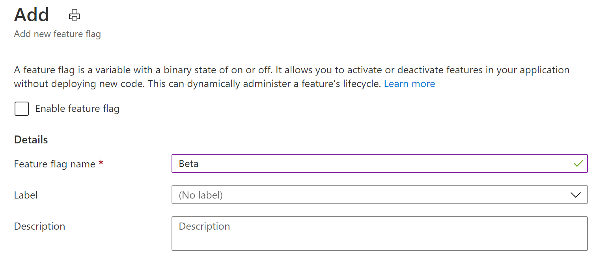

# <a name="quickstart-add-feature-flags-to-an-azure-functions-app"></a>Quickstart: Functiemarkeringen toevoegen aan een Azure Functions-app

In deze quickstart maakt u een Azure Functions-app en gebruikt u hierin functievlaggen. U gebruikt functiebeheer van Azure App Configuration om al uw functievlaggen centraal op te slaan en hun status te bepalen.

De .NET Feature Management-bibliotheken breiden het framework uit met ondersteuning voor functiemarkeringen. Deze bibliotheken worden boven op het .NET-configuratiesysteem gebouwd. Ze integreren naadloos met App Configuration via de configuratieprovider voor .NET.

## <a name="prerequisites"></a>Vereisten

- Azure-abonnement: [u kunt een gratis abonnement nemen](https://azure.microsoft.com/free/)
- [Visual Studio 2019](https://visualstudio.microsoft.com/vs) met de workload **Azure Development**.
- [Hulpprogramma's van Azure Functions](../azure-functions/functions-develop-vs.md#check-your-tools-version)

## <a name="create-an-app-configuration-store"></a>Een App Configuration-archief maken

[!INCLUDE [azure-app-configuration-create](../../includes/azure-app-configuration-create.md)]

7. Selecteer **Functiebeheer** >  **+ Toevoegen** om een functievlag met de naam `Beta` toe te voegen.

    > [!div class="mx-imgBorder"]
    > 

    Laat `label` en `Description` voor nu ongedefinieerd.

8. Selecteer **Toepassen** om de nieuwe functievlag op te slaan.

## <a name="create-a-functions-app"></a>Een Functions-app maken

[!INCLUDE [Create a project using the Azure Functions template](../../includes/functions-vstools-create.md)]

## <a name="connect-to-an-app-configuration-store"></a>Verbinding maken met een App Configuration-archief

In dit project wordt gebruikgemaakt van [afhankelijkheidsinjectie in .NET Azure Functions](../azure-functions/functions-dotnet-dependency-injection.md). Hierbij wordt Azure App Configuration wordt toegevoegd als een extra configuratiebron waar uw functievlaggen worden opgeslagen.

1. Klik met de rechtermuisknop op het project en selecteer **NuGet-pakketten beheren**. Zoek op het tabblad **Bladeren** de volgende NuGet-pakketten en voeg deze toe aan uw project.
   - [Microsoft.Extensions.Configuration.AzureAppConfiguration](https://www.nuget.org/packages/Microsoft.Extensions.Configuration.AzureAppConfiguration/) versie 4.1.0 of nieuwer
   - [Microsoft.FeatureManagement](https://www.nuget.org/packages/Microsoft.FeatureManagement/) versie 2.2.0 of nieuwer
   - [Microsoft.Azure.Functions.Extensions](https://www.nuget.org/packages/Microsoft.Azure.Functions.Extensions/) versie 1.1.0 of nieuwer 

2. Voeg het nieuwe bestand *Startup.cs* toe met de volgende code. Hiermee wordt een klasse gedefinieerd met de naam `Startup`, waarmee de abstracte klasse `FunctionsStartup` wordt geïmplementeerd. Er wordt een assembly-kenmerk gebruikt om de typenaam op te geven die wordt gebruikt tijdens het opstarten van Azure Functions.

    ```csharp
    using System;
    using Microsoft.Azure.Functions.Extensions.DependencyInjection;
    using Microsoft.Extensions.Configuration;
    using Microsoft.FeatureManagement;

    [assembly: FunctionsStartup(typeof(FunctionApp.Startup))]

    namespace FunctionApp
    {
        class Startup : FunctionsStartup
        {
            public override void ConfigureAppConfiguration(IFunctionsConfigurationBuilder builder)
            {
            }

            public override void Configure(IFunctionsHostBuilder builder)
            {
            }
        }
    }
    ```


3. Werk de `ConfigureAppConfiguration`-methode bij en voeg de Azure App Configuration-provider toe als een extra configuratiebron door `AddAzureAppConfiguration()` aan te roepen. 

   De `UseFeatureFlags()`-methode geeft de provider opdracht de functievlaggen te laden. Alle functievlaggen hebben een standaardvervalperiode voor de cache van dertig seconden voordat opnieuw op wijzigingen wordt gecontroleerd. De verlooptijd kan worden bijgewerkt door de eigenschap `FeatureFlagsOptions.CacheExpirationInterval` in te stellen die wordt doorgegeven aan de methode `UseFeatureFlags`. 

    ```csharp
    public override void ConfigureAppConfiguration(IFunctionsConfigurationBuilder builder)
    {
        builder.ConfigurationBuilder.AddAzureAppConfiguration(options =>
        {
            options.Connect(Environment.GetEnvironmentVariable("ConnectionString"))
                   .Select("_")
                   .UseFeatureFlags();
        });
    }
    ```
   > [!TIP]
   > Als u niet wilt dat een andere configuratie dan functievlaggen naar uw toepassing wordt geladen, kunt u `Select("_")` aanroepen om alleen een niet-bestaande dummysleutel (_) te laden. Standaard worden alle configuratiesleutelwaarden in uw App Configuration-archief geladen indien geen methode `Select` wordt aangeroepen.

4. Werk de methode `Configure` bij om Azure App Configuration-services en functiebeheer beschikbaar te maken via afhankelijkheidsinjectie.

    ```csharp
    public override void Configure(IFunctionsHostBuilder builder)
    {
        builder.Services.AddAzureAppConfiguration();
        builder.Services.AddFeatureManagement();
    }
    ```

5. Open *Function1.cs* en voeg de volgende naamruimten toe.

    ```csharp
    using System.Linq;
    using Microsoft.FeatureManagement;
    using Microsoft.Extensions.Configuration.AzureAppConfiguration;
    ```

   Voeg een constructor toe om een exemplaar van `_featureManagerSnapshot` en `IConfigurationRefresherProvider` te verkrijgen via afhankelijkheidsinjectie. Vanuit de `IConfigurationRefresherProvider` kunt u het exemplaar van `IConfigurationRefresher` verkrijgen.

    ```csharp
    private readonly IFeatureManagerSnapshot _featureManagerSnapshot;
    private readonly IConfigurationRefresher _configurationRefresher;

    public Function1(IFeatureManagerSnapshot featureManagerSnapshot, IConfigurationRefresherProvider refresherProvider)
    {
        _featureManagerSnapshot = featureManagerSnapshot;
        _configurationRefresher = refresherProvider.Refreshers.First();
    }
    ```

6. Werk de methode `Run` bij om de waarde van het weergegeven bericht te wijzigen, afhankelijk van de status van de functievlag.

   De methode `TryRefreshAsync` wordt aangeroepen aan het begin van de functieaanroep om functievlaggen te vernieuwen. Er gebeurt niets (no-op) als de vervaltijd van de cache niet wordt bereikt. Verwijder de operator `await` als u de functievlaggen liever wilt vernieuwen zonder dat de huidige aanroep van Functions wordt geblokkeerd. In dat geval krijgen latere aanroepen van Functions een bijgewerkte waarde.

    ```csharp
    [FunctionName("Function1")]
    public async Task<IActionResult> Run(
        [HttpTrigger(AuthorizationLevel.Anonymous, "get", "post", Route = null)] HttpRequest req,
        ILogger log)
    {
        log.LogInformation("C# HTTP trigger function processed a request.");

        await _configurationRefresher.TryRefreshAsync();

        string message = await _featureManagerSnapshot.IsEnabledAsync("Beta")
                ? "The Feature Flag 'Beta' is turned ON"
                : "The Feature Flag 'Beta' is turned OFF";

        return (ActionResult)new OkObjectResult(message);
    }
    ```

## <a name="test-the-function-locally"></a>De functie lokaal testen

1. Stel een omgevingsvariabele in met de naam **ConnectionString**, waarbij de waarde de verbindingsreeks is die u eerder in uw App Configuration-archief hebt opgehaald onder **Toegangssleutels**. Als u de Windows-opdrachtprompt gebruikt, voert u de volgende opdracht uit en start u de opdrachtprompt opnieuw om de wijziging door te voeren:

    ```cmd
        setx ConnectionString "connection-string-of-your-app-configuration-store"
    ```

    Als u Windows PowerShell gebruikt, voert u de volgende opdracht uit:

    ```azurepowershell
        $Env:ConnectionString = "connection-string-of-your-app-configuration-store"
    ```

    Als u macOS of Linux gebruikt, voert u de volgende opdracht uit:

    ```bash
        export ConnectionString='connection-string-of-your-app-configuration-store'
    ```

1. Druk op F5 om de functie testen. Accepteer desgevraagd de aanvraag van Visual Studio om **Azure Functions Core-hulpprogramma's (CLI)** te downloaden en installeren. Mogelijk moet u ook een firewall-uitzondering inschakelen, zodat de hulpprogramma's HTTP-aanvragen kunnen afhandelen.

1. Kopieer de URL van uw functie vanuit de uitvoer van de Azure Functions-runtime.

    

1. Plak de URL van de HTTP-aanvraag in de adresbalk van uw browser. In de volgende afbeelding ziet u het antwoord dat aangeeft dat de functiemarkering `Beta` is uitgeschakeld. 

    

1. Meld u aan bij de [Azure-portal](https://portal.azure.com). Selecteer **Alle resources** en selecteer het App Configuration-archief dat u hebt gemaakt.

1. Selecteer **Functiebeheer** en wijzig de status van de sleutel **Beta** in **Aan**:

1. Vernieuw de browser een paar keer. Wanneer de in de cache geplaatste functievlag na dertig seconden vervalt, moet de pagina zijn gewijzigd om aan te geven dat functievlag `Beta` is ingeschakeld, zoals wordt weergegeven in de onderstaande afbeelding.
 
    

> [!NOTE]
> De voorbeeldcode in deze zelfstudie kan worden gedownload van de [Azure App Configuration GitHub repo](https://github.com/Azure/AppConfiguration/tree/master/examples/DotNetCore/AzureFunction) (GitHub-opslagplaats in Azure App Configuration).

## <a name="clean-up-resources"></a>Resources opschonen

[!INCLUDE [azure-app-configuration-cleanup](../../includes/azure-app-configuration-cleanup.md)]

## <a name="next-steps"></a>Volgende stappen

In deze quickstart hebt u een nieuwe functievlag gemaakt en gebruikt met een Azure Functions-app via de bibliotheek [Microsoft.FeatureManagement](/dotnet/api/microsoft.featuremanagement).

- Meer informatie over [functiebeheer](./concept-feature-management.md)
- [Functievlaggen beheren](./manage-feature-flags.md)
- [Voorwaardelijke functievlaggen gebruiken](./howto-feature-filters-aspnet-core.md)
- [Gefaseerde implementatie van functies voor doelgroepen inschakelen](./howto-targetingfilter-aspnet-core.md)
- [Dynamische configuratie gebruiken in een Azure Functions-app](./enable-dynamic-configuration-azure-functions-csharp.md)