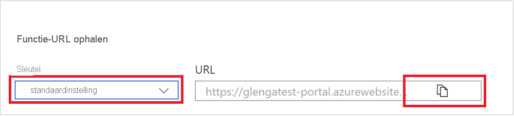

# Uw eerste functie maken in Azure Portal

Azure Functions kunt u uw code uitvoeren in een serverloze omgeving zonder dat u eerst een virtuele machine (VM) moet maken of een webtoepassing moet publiceren. In dit artikel leert u hoe u Azure Functions http-triggerfunctie 'hallo wereld' maakt in de Azure Portal.

[!INCLUDE [functions-in-portal-editing-note](../../includes/functions-in-portal-editing-note.md)] 

In plaats daarvan raden we u aan [om uw functies lokaal te ontwikkelen](functions-develop-local.md) en te publiceren naar een functie-app in Azure.  
Gebruik een van de volgende koppelingen om aan de slag te gaan met uw gekozen lokale ontwikkelomgeving en taal:

| Visual Studio Code | Terminal/opdrachtprompt | Visual Studio |
| --- | --- | --- |
|  &bull;&nbsp;[Aan de slag met C #](./create-first-function-vs-code-csharp.md) &bull;&nbsp;[Aan de slag met Java](./create-first-function-vs-code-java.md) &bull;&nbsp;[Aan de slag met JavaScript](./create-first-function-vs-code-node.md) &bull;&nbsp;[Aan de slag met PowerShell](./create-first-function-vs-code-powershell.md) &bull;&nbsp;[Aan de slag met Python](./create-first-function-vs-code-python.md) |&bull;&nbsp;[Aan de slag met C #](./create-first-function-cli-csharp.md) &bull;&nbsp;[Aan de slag met Java](./create-first-function-cli-java.md) &bull;&nbsp;[Aan de slag met JavaScript](./create-first-function-cli-node.md) &bull;&nbsp;[Aan de slag met PowerShell](./create-first-function-cli-powershell.md) &bull;&nbsp;[Aan de slag met Python](./create-first-function-cli-python.md) | [Aan de slag met C #](functions-create-your-first-function-visual-studio.md) |

[!INCLUDE [quickstarts-free-trial-note](../../includes/quickstarts-free-trial-note.md)]

## Aanmelden bij Azure

Meld u met uw Azure-account aan bij [Azure Portal](https://portal.azure.com).

## Een functie-app maken

U moet een functie-app hebben die als host fungeert voor de uitvoering van uw functies. Met een functie-app kunt u functies groeperen in een logische eenheid, zodat u resources eenvoudiger kunt beheren, implementeren, schalen en delen.

[!INCLUDE [Create function app Azure portal](../../includes/functions-create-function-app-portal.md)]

Maak vervolgens een functie in de nieuwe functie-app.

## Een HTTP-triggerfunctie maken

1. Selecteer in het menu links van het venster **Functies** de optie **Functies** en selecteer vervolgens **Toevoegen** in het bovenste menu. 
 
1. Selecteer in **het venster Functie** toevoegen de sjabloon **HTTP-trigger.**

    

1. Kies **onder Sjabloondetails** gebruiken voor nieuwe functie de optie Anoniem in de vervolgkeuzelijst Autorisatieniveau `HttpExample` en selecteer vervolgens **Toevoegen.**   ****

    Azure maakt de HTTP-triggerfunctie. U kunt de nieuwe functie nu uitvoeren door een HTTP-aanvraag te verzenden.

## De functie testen

1. Selecteer in de nieuwe HTTP-triggerfunctie **Code + Testen** in het linkermenu en selecteer vervolgens **Functie-URL downloaden** in het bovenste menu.

    

1. Selecteer in **het dialoogvenster Functie-URL** downloaden de standaardinstelling **in** de vervolgkeuzelijst en selecteer vervolgens het pictogram Kopiëren **naar klembord.** 

    

1. Plak de URL van de functie in de adresbalk van uw browser. Voeg de waarde van de `?name=<your_name>` queryreeks toe aan het einde van deze URL en druk op Enter om de aanvraag uit te voeren. In de browser moet een antwoordbericht worden weergegeven dat de waarde van de queryreeks herhaalt. 

    Als de aanvraag-URL een [toegangssleutel](functions-bindings-http-webhook-trigger.md#authorization-keys) ( ) bevat, betekent dit dat u functie kiest in plaats van anoniem toegangsniveau `?code=...` bij het maken van de functie.   In dit geval moet u in plaats daarvan `&name=<your_name>` .

1. Wanneer uw functie wordt uitgevoerd, wordt traceringsinformatie naar de logboeken geschreven. Als u de traceeruitvoer wilt zien, gaat u terug naar de **pagina Code en testen** in de portal en vouwt u de pijl **Logboeken** onder aan de pagina uit. Roep de functie opnieuw aan om traceeruitvoer te zien die naar de logboeken wordt geschreven. 

    :::image type="content" source="media/functions-create-first-azure-function/function-view-logs.png" alt-text="Logboeken van Functions in de Azure Portal":::

## Resources opschonen

[!INCLUDE [Clean-up resources](../../includes/functions-quickstart-cleanup.md)]

## Volgende stappen

[!INCLUDE [Next steps note](../../includes/functions-quickstart-next-steps.md)]
