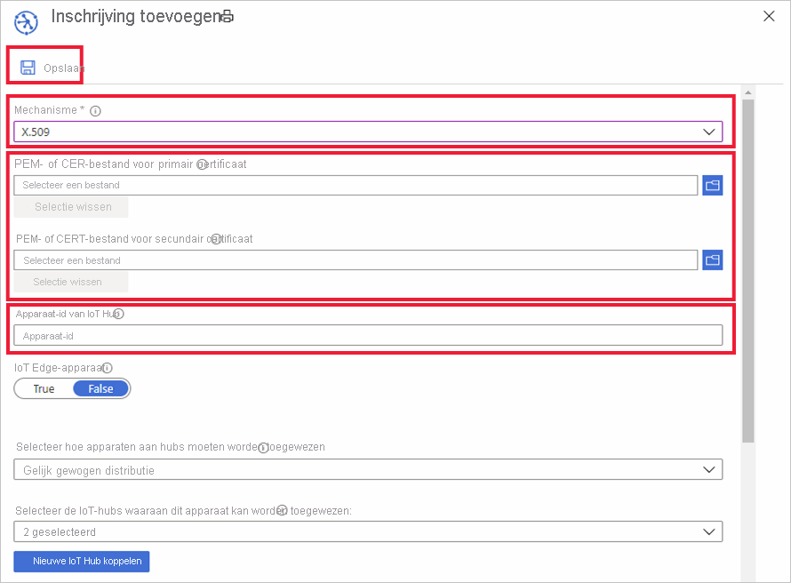

# Inschrijvingen van apparaten beheren met Azure Portal

Een *apparaatregistratie* maakt een record van één apparaat of een groep apparaten die op een bepaald moment bij de Azure-IOT hub Device Provisioning Service kunnen worden geregistreerd. De registratie record bevat de initiële configuratie voor de apparaten die deel uitmaken van de registratie. Opgenomen in de configuratie is de IoT-hub waaraan een apparaat wordt toegewezen of een toewijzings beleid waarmee de hub van een set hubs wordt geconfigureerd. In dit artikel leest u hoe u de registratie van apparaten voor uw inrichtings service kunt beheren.

## Een apparaatinschrijving maken

Er zijn twee manieren waarop u uw apparaten kunt inschrijven bij de inrichtings service:

* Een **registratie groep** is een vermelding voor een groep apparaten die een gemeen schappelijk Attestation-mechanisme delen. U kunt het beste een registratie groep gebruiken voor een groot aantal apparaten die een initiële configuratie delen, of voor apparaten die allemaal naar dezelfde Tenant gaan. Apparaten die gebruikmaken van [symmetrische sleutel](concepts-symmetric-key-attestation.md) of [X. 509-certificaten](concepts-x509-attestation.md) worden ondersteund. 

    Zie de zelf studie [apparaten inrichten met symmetrische sleutels](how-to-legacy-device-symm-key.md) voor stapsgewijze instructies voor het maken en gebruiken van registratie groepen met symmetrische sleutels.

    U maakt een registratie groep in de portal voor een groep apparaten door de volgende stappen uit te voeren:

    1. Meld u aan bij de Azure Portal en klik op **alle resources** in het menu aan de linkerkant.  
    1. Klik in de lijst met resources op de Device Provisioning Service waarop u uw apparaat wilt registreren.  
    1. Klik in uw inrichtings service op **registraties beheren** en klik bovenaan op de knop **registratie groep toevoegen** .  
     
        
        
    1. Wanneer het paneel registratie groep toevoegen wordt weer gegeven, voert u de gegevens voor uw inschrijving in en klikt u op **Opslaan**.  
     
        
        
        | Veld | Description |
        | :--- | :--- |
        | **Groepsnaam** | De vereiste naam voor uw groep apparaten. |
        | **Type verklaring** | Klik op **certificaat** of **symmetrische sleutel** voor het Attestation-type, afhankelijk van de Attestation-methode die uw apparaten zullen gebruiken. |
        | **Certificaattype** | Beschikbaar als u certificaat Attestation gebruikt. Selecteer **CA-certificaat** of **tussenliggende** waarde op basis van het certificaat dat uw apparaat certificaten heeft ondertekend. |
        | **Primair certificaat** | Als u de certificaten van uw apparaat wilt ondertekenen met een basis-CA-certificaat, moet het certificaat [van](how-to-verify-certificates.md) de basis-CA zijn voltooid. Vervolgens kunt u deze selecteren als **primair certificaat** voor de groep apparaten.  Als u de certificaten van uw apparaat met een tussenliggend certificaat ondertekent, is een knop uploaden beschikbaar waarmee u uw tussenliggende certificaat kunt uploaden. Voor het certificaat dat de tussenliggende hand tekening heeft ondertekend, moet ook het [bewijs worden genoteerd](how-to-verify-certificates.md) . |

        
    

* Een **Individuele inschrijving** is een vermelding voor één apparaat dat kan worden toegewezen aan een IOT-hub. Apparaten die gebruikmaken van [symmetrische sleutels](concepts-symmetric-key-attestation.md), [X. 509-certificaten](concepts-x509-attestation.md)en [TPM-Attestation](concepts-tpm-attestation.md) worden ondersteund. 

    U kunt met behulp van de volgende stappen een afzonderlijke inschrijving maken in de portal:

    1. Meld u aan bij de Azure Portal en klik op **alle resources** in het menu aan de linkerkant.
    1. Klik in de lijst met resources op de Device Provisioning Service waarop u uw apparaat wilt registreren.
    1. Klik in uw inrichtings service op **registraties beheren** en klik vervolgens op de knop **afzonderlijke registratie toevoegen** bovenaan.   

       

    1. Wanneer het deel venster inschrijving toevoegen wordt weer gegeven, voert u de gegevens voor de inschrijving van het individuele apparaat in en klikt u op **Opslaan**. 
     
        
    
        | Veld | Description |
        | :--- | :--- |
        | **Mechanisme** | Selecteer **X. 509**, **TPM** of **symmetrische sleutel** voor het Attestation-mechanisme dat moet worden gebruikt, afhankelijk van de Attestation-methode die uw apparaten gebruiken. |
        | Attestation-instellingen | Voor stapsgewijze instructies over het maken en gebruiken van afzonderlijke inschrijvingen met symmetrische sleutels of X. 509-certificaten, zie een van de [richt lijnen voor een symmetrisch apparaat](quick-create-simulated-device-symmetric-key-java.md#create-a-device-enrollment) of het [inrichten van een X. 509-certificaat apparaat](quick-create-simulated-device-x509-java.md#create-a-self-signed-x509-device-certificate-and-individual-enrollment-entry) Quick starts.  Zie een van de voor beelden van [een gesimuleerd TPM-apparaat](quick-create-simulated-device-tpm-java.md#create-a-device-enrollment-entry) voor stapsgewijze instructies voor het maken en gebruiken van afzonderlijke inschrijvingen met behulp van TPM-Attestation.|
        | **IoT Hub apparaat-ID** |  Deze ID geeft uw apparaat weer. Het moet de regels voor een apparaat-id volgen. Zie [Eigenschappen van apparaat-id](../iot-hub/iot-hub-devguide-identity-registry.md#device-identity-properties) voor meer informatie.  Wanneer u X. 509-certificaten gebruikt, moet deze tekst de onderwerpnaam zijn van het certificaat van het apparaat dat u voor de registratie uploadt. De onderwerpnaam moet voldoen aan de regels voor een apparaat-ID.|
            

## Een inschrijvings vermelding bijwerken
U kunt een bestaande inschrijvings vermelding in de portal bijwerken met behulp van de volgende stappen:

1. Open uw Device Provisioning Service in de Azure Portal en klik op **inschrijvingen beheren**. 
1. Navigeer naar de inschrijvings vermelding die u wilt wijzigen. Klik op het item om een samen vatting te openen van de registratie van uw apparaat. 
1. Op deze pagina kunt u andere items dan het beveiligings type en de referenties wijzigen, zoals de IoT-hub waaraan het apparaat moet worden gekoppeld en de apparaat-ID. U kunt ook de eerste dubbele status van het apparaat wijzigen. 
1. Zodra u klaar bent, klikt u op **Opslaan** om de registratie van uw apparaat bij te werken. 

    

## Registratie van een apparaat verwijderen
Als uw apparaat (en) niet moeten worden ingericht voor een IoT-hub, kunt u de bijbehorende inschrijvings vermelding in de Portal verwijderen door de volgende stappen uit te voeren:

1. Open uw Device Provisioning Service in de Azure Portal en klik op **inschrijvingen beheren**. 
1. Navigeer naar en selecteer de inschrijvings vermelding die u wilt verwijderen. 
1. Klik bovenaan op de knop **verwijderen** en selecteer vervolgens **Ja** wanneer u wordt gevraagd om te bevestigen. 
1. Zodra de actie is voltooid, ziet u dat uw vermelding is verwijderd uit de lijst met geregistreerde apparaten. 
 
    