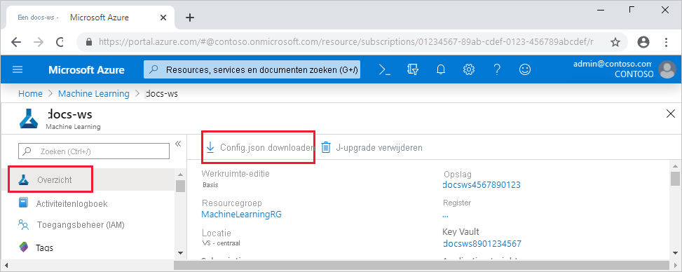

# <a name="set-up-a-python-development-environment-for-azure-machine-learning"></a>Een Python-ontwikkelomgeving instellen voor Azure Machine Learning

Meer informatie over het configureren van een Python-ontwikkelomgeving voor Azure Machine Learning.

In de volgende tabel ziet u elke ontwikkelomgeving die in dit artikel wordt behandeld, samen met voor- en nadelen.

| Omgeving | Voordelen | Nadelen |
| --- | --- | --- |
| [Lokale omgeving](#local) | Volledige controle over uw ontwikkelomgeving en afhankelijkheden. Voer uit met elk build-hulpprogramma, elke omgeving of IDE van uw keuze. | Het duurt langer om aan de slag te gaan. De benodigde SDK-pakketten moeten worden geïnstalleerd en er moet ook een omgeving worden geïnstalleerd als u er nog geen hebt. |
| [De Data Science Virtual Machine (DSVM)](#dsvm) | Vergelijkbaar met het cloud-gebaseerde reken-exemplaar (Python en de SDK zijn vooraf geïnstalleerd), maar met extra populaire hulpprogramma's voor gegevenswetenschap en machine learning vooraf geïnstalleerd. Eenvoudig te schalen en te combineren met andere aangepaste hulpprogramma's en werkstromen. | Een tragere aan de slag-ervaring vergeleken met de cloudgebaseerde reken-instantie. |
| [Azure Machine Learning-rekeninstantie](#compute-instance) | De eenvoudigste manier om aan de slag te gaan. De volledige SDK is al geïnstalleerd in uw werkruimte-VM en notebookzelfstudies zijn vooraf gekloond en klaar om te worden uitgevoerd. | Geen controle over uw ontwikkelomgeving en afhankelijkheden. Extra kosten voor Linux-VM (VM kan worden gestopt wanneer deze niet in gebruik is om kosten te voorkomen). Zie [prijsinformatie.](https://azure.microsoft.com/pricing/details/virtual-machines/linux/) |
| [Azure Databricks](how-to-configure-databricks-automl-environment.md) | Ideaal voor het uitvoeren van grootschalige intensieve machine learning werkstromen op het schaalbare Apache Spark platform. | Overkill voor experimentele machine learning experimenten en werkstromen op kleinere schaal. Extra kosten voor Azure Databricks. Zie [prijsinformatie.](https://azure.microsoft.com/pricing/details/databricks/) |

Dit artikel bevat ook aanvullende gebruikstips voor de volgende hulpprogramma's:

* Jupyter Notebooks: als u Jupyter Notebooks al gebruikt, heeft de SDK enkele extra's die u moet installeren.

* Visual Studio Code: als u Visual Studio Code gebruikt, bevat de [Azure Machine Learning-extensie](https://marketplace.visualstudio.com/items?itemName=ms-toolsai.vscode-ai) uitgebreide taalondersteuning voor Python en functies om het werken met de Azure Machine Learning veel handiger en productiever te maken.

## <a name="prerequisites"></a>Vereisten

* Azure Machine Learning werkruimte. Als u nog geen werkruimte hebt, kunt u een Azure Machine Learning maken via de [Azure Portal,](how-to-manage-workspace.md) [Azure CLI](how-to-manage-workspace-cli.md#create-a-workspace)en [Azure Resource Manager sjablonen.](how-to-create-workspace-template.md)

### <a name="local-and-dsvm-only-create-a-workspace-configuration-file"></a><a id="workspace"></a> Alleen lokale en DSVM: een configuratiebestand voor de werkruimte maken

Het configuratiebestand van de werkruimte is een JSON-bestand dat de SDK vertelt hoe deze moet communiceren met Azure Machine Learning werkruimte. Het bestand heeft de *config.jsop* en heeft de volgende indeling:

```json
{
    "subscription_id": "<subscription-id>",
    "resource_group": "<resource-group>",
    "workspace_name": "<workspace-name>"
}
```

Dit JSON-bestand moet zich in de mapstructuur met uw Python-scripts of Jupyter Notebooks. Deze kan zich in dezelfde map, een submap met de naam *.azureml* of in een bovenliggende map.

Als u dit bestand uit uw code wilt gebruiken, gebruikt u de [`Workspace.from_config`](/python/api/azureml-core/azureml.core.workspace.workspace#from-config-path-none--auth-none---logger-none---file-name-none-) methode . Deze code laadt de informatie uit het bestand en maakt verbinding met uw werkruimte.

Maak een configuratiebestand voor de werkruimte op een van de volgende manieren:

* Azure Portal

    **Download het bestand**: selecteer in [Azure Portal](https://ms.portal.azure.com)de optie config.js **downloaden in** de **sectie** Overzicht van uw werkruimte.

    

* Azure Machine Learning Python SDK

    Maak een script om verbinding te maken met uw Azure Machine Learning werkruimte en gebruik de methode om uw bestand te genereren en op te slaan [`write_config`](/python/api/azureml-core/azureml.core.workspace.workspace#write-config-path-none--file-name-none-) als *.azureml/config.jsop*. Zorg ervoor dat u `subscription_id` , en vervangt door uw `resource_group` `workspace_name` eigen.

    ```python
    from azureml.core import Workspace

    subscription_id = '<subscription-id>'
    resource_group  = '<resource-group>'
    workspace_name  = '<workspace-name>'

    try:
        ws = Workspace(subscription_id = subscription_id, resource_group = resource_group, workspace_name = workspace_name)
        ws.write_config()
        print('Library configuration succeeded')
    except:
        print('Workspace not found')
    ```

## <a name="local-computer-or-remote-vm-environment"></a><a id="local"></a>Lokale computer of externe VM-omgeving

U kunt een omgeving instellen op een lokale computer of externe virtuele machine, zoals een Azure Machine Learning compute-exemplaar of Data Science VM. 

Een lokale ontwikkelomgeving of externe VM configureren:

1. Maak een virtuele Python-omgeving (virtualenv, conda).

    > [!NOTE]
    > Hoewel dit niet vereist is, is het raadzaam [anaconda](https://www.anaconda.com/download/) of [Miniconda](https://www.anaconda.com/download/) te gebruiken om virtuele Python-omgevingen te beheren en pakketten te installeren.

    > [!IMPORTANT]
    > Als u Linux of macOS gebruikt en een andere shell dan bash gebruikt (bijvoorbeeld zsh), kunnen er fouten optreden wanneer u een aantal opdrachten uit te voeren. U kunt dit probleem oplossen door de opdracht te `bash` gebruiken om een nieuwe bash-shell te starten en de opdrachten daar uit te voeren.

1. Activeer uw zojuist gemaakte virtuele Python-omgeving.
1. Installeer de [Azure Machine Learning Python SDK.](/python/api/overview/azure/ml/install)
1. Als u uw lokale omgeving wilt configureren voor het gebruik van Azure Machine Learning werkruimte, maakt u [een](#workspace) configuratiebestand voor de werkruimte of gebruikt u een bestaande werkruimte.

Nu u uw lokale omgeving hebt ingesteld, kunt u aan de slag met Azure Machine Learning. Zie de [Azure Machine Learning aan de slag met Python om](tutorial-1st-experiment-sdk-setup-local.md) aan de slag te gaan.

### <a name="jupyter-notebooks"></a><a id="jupyter"></a>Jupyter Notebooks

Wanneer u een lokale Jupyter Notebook server, is het raadzaam om een IPython-kernel te maken voor uw virtuele Python-omgeving. Dit zorgt ervoor dat het verwachte gedrag voor het importeren van kernels en pakketten wordt gegarandeerd.

1. Omgevingsspecifieke IPython-kernels inschakelen

    ```bash
    conda install notebook ipykernel
    ```

1. Maak een kernel voor uw virtuele Python-omgeving. Zorg ervoor dat u vervangt `<myenv>` door de naam van uw virtuele Python-omgeving.

    ```bash
    ipython kernel install --user --name <myenv> --display-name "Python (myenv)"
    ```

1. Start de Jupyter Notebook server

Zie de [Azure Machine Learning notebooks om](https://github.com/Azure/MachineLearningNotebooks) aan de slag te gaan met Azure Machine Learning en Jupyter Notebooks.

> [!NOTE]
> Een door de community gestuurde opslagplaats met voorbeelden vindt u op https://github.com/Azure/azureml-examples.

### <a name="visual-studio-code"></a><a id="vscode"></a>Visual Studio Code

Als u Visual Studio Code wilt gebruiken voor ontwikkeling:

1. Installeer [Visual Studio Code](https://code.visualstudio.com/Download).
1. Installeer de [Azure Machine Learning Visual Studio Code-extensie](tutorial-setup-vscode-extension.md) (preview).

Nadat u de Visual Studio Code-extensie hebt geïnstalleerd, gebruikt u deze om:

* [Uw Azure Machine Learning beheren](how-to-manage-resources-vscode.md)
* [Verbinding maken met een Azure Machine Learning reken-exemplaar](how-to-set-up-vs-code-remote.md)
* [Experimenten uitvoeren en fouten opsporen](how-to-debug-visual-studio-code.md)
* [Getrainde modellen implementeren.](tutorial-train-deploy-image-classification-model-vscode.md)

## <a name="azure-machine-learning-compute-instance"></a><a id="compute-instance"></a>Azure Machine Learning compute-exemplaar

De Azure Machine Learning compute-instantie [is](concept-compute-instance.md) een beveiligd, cloudgebaseerd Azure-werkstation dat gegevenswetenschappers een Jupyter Notebook-server, JupyterLab en een volledig beheerde machine learning biedt.

Er is niets om te installeren of configureren voor een reken-exemplaar.  

Maak er op elk gewenst moment een vanuit uw Azure Machine Learning werkruimte. Geef alleen een naam op en geef een Azure-VM-type op. Probeer het nu met deze [zelfstudie: Omgeving en werkruimte instellen.](tutorial-1st-experiment-sdk-setup.md)

Zie Create and manage an Azure Machine Learning compute instance (Een reken-exemplaar maken Azure Machine Learning beheren) voor meer informatie over reken-exemplaren, waaronder het [installeren van pakketten.](how-to-create-manage-compute-instance.md)

> [!TIP]
> Als u wilt voorkomen dat er kosten in rekening worden gebracht voor een ongebruikt rekenin exemplaar, [stopt u het rekenin exemplaar](how-to-create-manage-compute-instance.md#manage).

Naast een Jupyter Notebook-server en JupyterLab kunt u reken-exemplaren gebruiken in de geïntegreerde [notebookfunctie in Azure Machine Learning-studio](how-to-run-jupyter-notebooks.md).

U kunt ook de code-extensie Azure Machine Learning Visual Studio gebruiken om verbinding te maken met een [extern rekenexe exemplaar met behulp van VS Code.](how-to-set-up-vs-code-remote.md)

## <a name="data-science-virtual-machine"></a><a id="dsvm"></a>Data Science Virtual Machine

De Data Science VM is een aangepaste VM-afbeelding (virtuele machine) die u als ontwikkelomgeving kunt gebruiken. Het is ontworpen voor data science-werk met vooraf geconfigureerde hulpprogramma's en software, zoals:

  - Pakketten zoals TensorFlow, PyTorch, Scikit-learn, XGBoost en de Azure Machine Learning SDK
  - Populaire data science-hulpprogramma's, zoals een zelfstandige Spark-versie en een drill-functie
  - Azure-hulpprogramma's zoals de Azure CLI, AzCopy en Storage Explorer
  - Geïntegreerde ontwikkelomgevingen (IDE's), zoals Visual Studio Code en PyCharm
  - Jupyter Notebook Server

Zie de handleiding Data Science VM hulpprogramma's voor een uitgebreidere lijst met [hulpprogramma's.](data-science-virtual-machine/tools-included.md)

> [!IMPORTANT]
> Als u van plan bent om [](concept-compute-target.md) de Data Science VM als rekendoel voor uw trainings- of deferentietaken te gebruiken, wordt alleen Ubuntu ondersteund.

Als u de Data Science VM als een ontwikkelomgeving wilt gebruiken:

1. Maak een Data Science VM een van de volgende methoden:

    * Gebruik de Azure Portal om een [Ubuntu-](data-science-virtual-machine/dsvm-ubuntu-intro.md) of Windows-DSVM te maken. [](data-science-virtual-machine/provision-vm.md)
    * [Maak een Data Science VM met arm-sjablonen.](data-science-virtual-machine/dsvm-tutorial-resource-manager.md)
    * Azure CLI gebruiken

        Als u een Ubuntu-Data Science VM, gebruikt u de volgende opdracht:

        ```azurecli-interactive
        # create a Ubuntu Data Science VM in your resource group
        # note you need to be at least a contributor to the resource group in order to execute this command successfully
        # If you need to create a new resource group use: "az group create --name YOUR-RESOURCE-GROUP-NAME --location YOUR-REGION (For example: westus2)"
        az vm create --resource-group YOUR-RESOURCE-GROUP-NAME --name YOUR-VM-NAME --image microsoft-dsvm:linux-data-science-vm-ubuntu:linuxdsvmubuntu:latest --admin-username YOUR-USERNAME --admin-password YOUR-PASSWORD --generate-ssh-keys --authentication-type password
        ```

        Gebruik de volgende opdracht om een Windows-DSVM te maken:

        ```azurecli-interactive
        # create a Windows Server 2016 DSVM in your resource group
        # note you need to be at least a contributor to the resource group in order to execute this command successfully
        az vm create --resource-group YOUR-RESOURCE-GROUP-NAME --name YOUR-VM-NAME --image microsoft-dsvm:dsvm-windows:server-2016:latest --admin-username YOUR-USERNAME --admin-password YOUR-PASSWORD --authentication-type password
        ```

1. Activeer de Conda-omgeving met de Azure Machine Learning SDK.

    * Voor Ubuntu Data Science VM:

        ```bash
        conda activate py36
        ```

    * Voor Windows Data Science VM:

        ```bash
        conda activate AzureML
        ```

1. Als u de Data Science VM voor het gebruik van Azure Machine Learning [werkruimte,](#workspace) maakt u een configuratiebestand voor de werkruimte of gebruikt u een bestaand configuratiebestand.

Net als bij lokale omgevingen kunt u Visual Studio Code en de [Azure Machine Learning Visual Studio Code-extensie gebruiken](#vscode) om te communiceren met Azure Machine Learning.

Zie Data [Science Virtual Machines voor meer informatie.](https://azure.microsoft.com/services/virtual-machines/data-science-virtual-machines/)


## <a name="next-steps"></a>Volgende stappen

- [Train een model](tutorial-train-models-with-aml.md) op Azure Machine Learning met de MNIST-gegevensset.
- Zie de [Azure Machine Learning SDK voor Python.](/python/api/overview/azure/ml/intro) 
