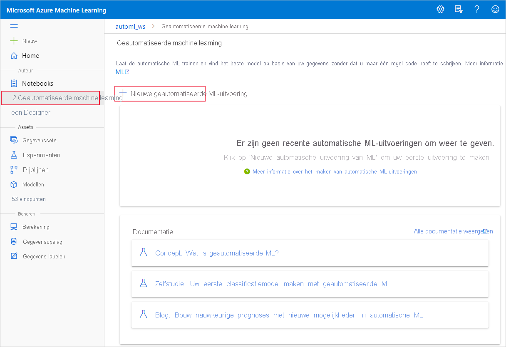

# Geautomatiseerde modellen maken, controleren en implementeren machine learning met Azure Machine Learning

In dit artikel leert u hoe u geautomatiseerde machine learning maakt, verkent en implementeert zonder één regel code in Azure Machine Learning-studio.

Geautomatiseerde machine learning is een proces waarbij het beste machine learning algoritme voor uw specifieke gegevens wordt geselecteerd. Met dit proces kunt u snel machine learning genereren. [Meer informatie over geautomatiseerde machine learning](concept-automated-ml.md).
 
Voor een end-to-end-voorbeeld kunt u de zelfstudie voor het maken van een classificatiemodel met [Azure Machine Learning van de geautomatiseerde ML-interface van de Azure Machine Learning gebruiken.](tutorial-first-experiment-automated-ml.md) 

Configureer voor een op code gebaseerde Python-ervaring uw geautomatiseerde [machine learning experimenten](how-to-configure-auto-train.md) met de Azure Machine Learning SDK.

## Vereisten

* Een Azure-abonnement. Als u geen Azure-abonnement hebt, maakt u een gratis account voordat u begint. Probeer vandaag nog de [gratis of betaalde versie van Azure Machine Learning](https://aka.ms/AMLFree).

* Een Azure Machine Learning-werkruimte. Raadpleeg [Een Azure Machine Learning-werkruimte maken](how-to-manage-workspace.md). 

## Aan de slag

1. Meld u aan bij [Azure Machine Learning Studio](https://ml.azure.com). 

1. Selecteer uw abonnement en werkruimte. 

1. Navigeer naar het linkerdeelvenster. Selecteer **Geautomatiseerde ML** in de **sectie** Auteur.

 Als dit de eerste keer is dat u experimenten doet, ziet u een lege lijst en koppelingen naar documentatie. 

Anders ziet u een lijst met uw recente geautomatiseerde machine learning experimenten, inclusief experimenten die zijn gemaakt met de SDK. 

## Experiment maken en uitvoeren

1. Selecteer **+ Nieuwe geautomatiseerde ML-run** en vul het formulier in.

1. Selecteer een gegevensset in uw opslagcontainer of maak een nieuwe gegevensset. Gegevenssets kunnen worden gemaakt op basis van lokale bestanden, web-URL's, gegevensstores of open Azure-gegevenssets. Meer informatie over het maken [van gegevenssets.](how-to-create-register-datasets.md)  

    >[!Important]
    > Vereisten voor trainingsgegevens:
    >* Gegevens moeten in tabelvorm zijn.
    >* De waarde die u wilt voorspellen (doelkolom) moet aanwezig zijn in de gegevens.

    1. Als u een nieuwe gegevensset wilt maken op basis van een bestand op uw lokale computer, selecteert **u +Gegevensset maken** en selecteert u **vervolgens Uit lokaal bestand.** 

    1. Geef in **het formulier Basisinformatie** uw gegevensset een unieke naam en geef een optionele beschrijving op. 

    1. Selecteer **Volgende om** het formulier Gegevens opslaan en **bestandsselectie te openen.** In dit formulier selecteert u waar u uw gegevensset wilt uploaden. de standaardopslagcontainer die automatisch wordt gemaakt met uw werkruimte of kies een opslagcontainer die u wilt gebruiken voor het experiment. 
    
        1. Als uw gegevens zich achter een virtueel netwerk, moet u de **validatiefunctie** overslaan inschakelen om ervoor te zorgen dat de werkruimte toegang heeft tot uw gegevens. Zie Use Azure Machine Learning-studio in an Azure virtual network (Een virtuele [azure-netwerk gebruiken) voor meer informatie.](how-to-enable-studio-virtual-network.md) 
    
    1. Selecteer **Bladeren om** het gegevensbestand voor uw gegevensset te uploaden. 

    1. Controleer het **formulier Instellingen en voorbeeld** op nauwkeurigheid. Het formulier wordt intelligent ingevuld op basis van het bestandstype. 

        Veld| Description
        ----|----
        Bestandsindeling| Definieert de indeling en het type gegevens dat is opgeslagen in een bestand.
        Scheidingsteken| Een of meer tekens die de grens aangeven tussen  afzonderlijke, onafhankelijke regio's in tekst zonder opmaak of andere gegevensstromen.
        Encoding| Identificeert welke bit-naar-tekenschematabel er moet gebruikt worden om uw gegevensset te lezen.
        Kolomkoppen| Geeft aan hoe eventuele koppen van de gegevensset worden behandeld.
        Rijen overslaan | Geeft aan hoeveel rijen er eventueel worden overgeslagen in de gegevensset.
    
        Selecteer **Next**.

    1. Het **formulier Schema** wordt intelligent ingevuld op basis van de selecties in het formulier Instellingen en **voorbeeld.** Configureer hier het gegevenstype voor elke kolom, controleer de kolomnamen en selecteer welke kolommen **u niet wilt opnemen** voor uw experiment. 
            
        Selecteer **Volgende**.

    1. Het **formulier Details bevestigen** is een samenvatting van de informatie die eerder is ingevuld in de formulieren **Basisgegevens** en Instellingen **en voorbeeld.** U hebt ook de mogelijkheid om een gegevensprofiel voor uw gegevensset te maken met behulp van een berekening met profilering ingeschakeld. Meer informatie over [gegevensprofilering](how-to-connect-data-ui.md#profile).

        Selecteer **Next**.
1. Selecteer de zojuist gemaakte gegevensset zodra deze wordt weergegeven. U kunt ook een voorbeeld van de gegevensset en voorbeeldstatistieken bekijken. 

1. Selecteer op **het formulier Configure run** de optie Create **new** en voer **Tutorial-automl-deploy in** als de naam van het experiment.

1. Selecteer een doelkolom; dit is de kolom waar u voorspellingen op wilt doen.

1. Selecteer een berekening voor de gegevensprofilering en trainings job. Een lijst met uw bestaande berekeningen is beschikbaar in de vervolgkeuzelijst. Volg de instructies in stap 7 om een nieuwe berekening te maken.

1. Selecteer **Een nieuwe berekening maken om** de compute-context voor dit experiment te configureren.

    Veld|Description
    ---|---
    Naam berekening| Voer een unieke naam in die uw compute-context identificeert.
    Prioriteit van virtuele machine| Virtuele machines met lage prioriteit zijn goedkoper, maar bieden geen garantie voor de rekenknooppunten. 
    Type virtuele machine| Selecteer CPU of GPU als type virtuele machine.
    Grootte van de virtuele machine| Selecteer de grootte van de virtuele machine voor uw berekening.
    Min / Max knooppunten| U moet u één of meer knooppunten opgeven om gegevens te profileren. Voer het maximum aantal knooppunten voor uw rekenkracht in. De standaardwaarde is 6 knooppunten voor een AML Compute.
    Geavanceerde instellingen | Met deze instellingen kunt u een gebruikersaccount en een bestaand virtueel netwerk configureren voor uw experiment. 
    
    Selecteer **Maken**. Het maken van een nieuwe berekening kan enkele minuten duren.

    >[!NOTE]
    > Uw rekennaam geeft aan of profilering is ingeschakeld voor de berekening die u *selecteert/maakt.* (Zie de sectie [gegevensprofilering](how-to-connect-data-ui.md#profile) voor meer informatie).

    Selecteer **Next**.

1. Selecteer op **het formulier Taaktype** en instellingen het taaktype: classificatie, regressie of prognose. Zie [Ondersteunde taaktypen](concept-automated-ml.md#when-to-use-automl-classify-regression--forecast) voor meer informatie.

    1. Voor **classificatie** kunt u ook deep learning inschakelen.
    
        Als Deep Learning is ingeschakeld, is validatie beperkt tot _train_validation splitsen._ [Meer informatie over validatieopties.](how-to-configure-cross-validation-data-splits.md)

    1. Voor **prognoses** kunt u: 
    
        1. Deep Learning inschakelen.
    
        1. Tijdkolom *selecteren:* deze kolom bevat de tijdgegevens die moeten worden gebruikt.

        1. *Prognoseperiode selecteren:* geef aan hoeveel tijdseenheden (minuten/uren/dagen/weken/maanden/jaren) het model voor de toekomst kan voorspellen. Hoe verder het model is vereist om in de toekomst te voorspellen, hoe minder nauwkeurig het wordt. [Meer informatie over prognoses en prognoseperioden.](how-to-auto-train-forecast.md)

1. (Optioneel) Aanvullende configuratie-instellingen weergeven: aanvullende instellingen die u kunt gebruiken om de trainings job beter te beheren. Anders worden de standaardinstellingen toegepast op basis van de selectie en gegevens van het experiment. 

    Aanvullende configuraties|Description
    ------|------
    Primaire metrische gegevens| Belangrijkste metrische gegevens die worden gebruikt om uw model te scoren. [Meer informatie over metrische modelgegevens.](how-to-configure-auto-train.md#primary-metric)
    Uitleg geven over het beste model | Selecteer in- of uitschakelen om uitleg over het aanbevolen model weer te geven.   Deze functionaliteit is momenteel niet beschikbaar voor [bepaalde prognosealgoritmen](how-to-machine-learning-interpretability-automl.md#interpretability-during-training-for-the-best-model). 
    Geblokkeerd algoritme| Selecteer algoritmen die u wilt uitsluiten van de trainings job.    Algoritmen toestaan is alleen beschikbaar voor [SDK-experimenten.](how-to-configure-auto-train.md#supported-models)   Zie de [ondersteunde modellen voor elk taaktype.](/python/api/azureml-automl-core/azureml.automl.core.shared.constants.supportedmodels)
    Criterium voor afsluiten| Wanneer aan een van deze criteria wordt voldaan, wordt de trainings job gestopt.   *Tijd van trainingsklus (uren)*: hoe lang de trainings job mag worden uitgevoerd.   *Drempelwaarde voor metrische score:* minimale metrische score voor alle pijplijnen. Dit zorgt ervoor dat als u een gedefinieerd doelmetrische gegevens hebt die u wilt bereiken, u niet meer tijd kwijt bent aan de trainings job dan nodig is.
    Validatie| Selecteer een van de kruisvalidatieopties die u in de trainings job wilt gebruiken.   [Meer informatie over kruisvalidatie.](how-to-configure-cross-validation-data-splits.md#prerequisites)   Prognoses ondersteunen alleen k-voudige kruisvalidatie.
    Gelijktijdigheid| *Maximum aantal gelijktijdige iteraties:* maximum aantal pijplijnen (iteraties) dat in de trainings job moet worden getest. De taak wordt niet meer dan het opgegeven aantal iteraties uitgevoerd. Meer informatie over hoe geautomatiseerde ML meerdere [onderliggende runs uitvoert op clusters](how-to-configure-auto-train.md#multiple-child-runs-on-clusters).

1. (Optioneel) Featurization-instellingen weergeven: als u Automatische featurization wilt **inschakelen** in het formulier Aanvullende configuratie-instellingen, worden standaard featurization-technieken toegepast.  In De **featurization-instellingen weergeven** kunt u deze standaardinstellingen wijzigen en dienovereenkomstig aanpassen. Meer informatie over [het aanpassen van featurizations.](#customize-featurization) 

    

## Featurization aanpassen

In het **formulier Featurization** kunt u automatische featurization in-/uitschakelen en de instellingen voor automatische featurization voor uw experiment aanpassen. Zie stap 10 in de sectie Experiment maken en uitvoeren om dit [formulier te](#create-and-run-experiment) openen. 

De volgende tabel bevat een overzicht van de aanpassingen die momenteel beschikbaar zijn via de studio. 

Kolom| Aanpassing
---|---
Inbegrepen | Hiermee geeft u op welke kolommen moeten worden op te nemen voor training.
Functietype| Wijzig het waardetype voor de geselecteerde kolom.
Impute met| Selecteer met welke waarde u ontbrekende waarden wilt imputeeren in uw gegevens.

## Experiment uitvoeren en resultaten weergeven

Selecteer **Voltooien om** uw experiment uit te voeren. Het voorbereiden van het experiment kan tot 10 minuten duren. Trainingstaken kunnen nog 2-3 minuten meer kosten voordat het uitvoeren van elke pijplijn is voltooid.

> [!NOTE]
> De algoritmen die door geautomatiseerde ML worden gebruikt, hebben inherente willekeurigheid die een kleine variatie kan veroorzaken in de uiteindelijke score voor metrische gegevens van een aanbevolen model, zoals nauwkeurigheid. Geautomatiseerde ML voert indien nodig ook bewerkingen uit op gegevens zoals trainen/testen splitsen, splitsing voor trainen/valideren of kruisvalidatie. Dus als u meerdere keren een experiment met dezelfde configuratie-instellingen en primaire metrische gegevens hebt uitgevoerd, ziet u waarschijnlijk variatie in elke experimenten uiteindelijke score voor metrische gegevens vanwege deze factoren. 

### Experimentdetails weergeven

Het **scherm Details** uitvoeren wordt geopend op het tabblad **Details.** In dit scherm ziet u een samenvatting van de experimentuit voeren met inbegrip van een statusbalk boven naast het nummer van de run. 

Het tabblad **Modellen** bevat een lijst met de gemaakte modellen, op volgorde van de metrische score. Standaardstaat het model dat het hoogst scoort op basis van het gekozen metrische gegeven bovenaan de lijst. Terwijl de trainingstaak meer modellen uitprobeert, worden deze toegevoegd aan de lijst. Gebruik dit om een snelle vergelijking te krijgen van de metrische gegevens voor de tot dusver geproduceerde modellen.

### Details van trainingsruns weergeven

Zoom in op een van de voltooide modellen om details van de trainingsuitvoering  te bekijken, zoals een modeloverzicht op het **tabblad Model** of grafieken met metrische prestatiegegevens op het tabblad Metrische gegevens. Meer informatie [over grafieken.](how-to-understand-automated-ml.md)

## Uitleg bij model (preview)

Om uw model beter te begrijpen, kunt u zien welke gegevensfuncties (onbewerkt of ontworpen) de voorspellingen van het model hebben beïnvloed met het dashboard voor modeluit leggen. 

Het dashboard voor model uitleg biedt een algemene analyse van het getrainde model, samen met de voorspellingen en uitleg. U kunt ook inzoomen op een afzonderlijk gegevenspunt en de afzonderlijke functie-belangrijkheid. [Meer informatie over de uitleg over dashboardvisualisaties.](how-to-machine-learning-interpretability-aml.md#visualizations)

Om uitleg te krijgen over een bepaald model, 

1. Selecteer op **het** tabblad Modellen het model dat u wilt begrijpen. 
1. Selecteer de **knop Model** uitleggen en geef een berekening op die kan worden gebruikt om de uitleg te genereren.
1. Controleer het **tabblad Onderliggende runs** op de status. 
1. Als u klaar is, gaat u naar **het tabblad Uitleg (preview)** dat het uitlegdashboard bevat. 

    

## Uw model implementeren

Zodra u het beste model hebt gevonden, is het tijd om dit te implementeren als een webservice, om nieuwe gegevens te voorspellen.

>[!TIP]
> Als u een model wilt implementeren dat is gegenereerd via het pakket met de Python SDK, moet u `automl` uw model [registreren](how-to-deploy-and-where.md?tabs=python#register-a-model-from-an-azure-ml-training-run-1) bij de werkruimte. 
>
> Zodra het model is geregistreerd, kunt u het vinden in de studio door Modellen te **selecteren** in het linkerdeelvenster. Zodra u uw model hebt  geopend, kunt u de knop Implementeren bovenaan het scherm selecteren en vervolgens de instructies volgen zoals beschreven in stap **2** van de sectie Uw **model** implementeren.

Geautomatiseerde ML helpt u bij het implementeren van het model zonder code te schrijven:

1. U hebt een aantal opties voor implementatie. 

    + Optie 1: implementeer het beste model volgens de metrische criteria die u hebt gedefinieerd. 
        1. Nadat het experiment is voltooid, gaat u naar de bovenliggende run-pagina door **1 uitvoeren bovenaan** het scherm te selecteren. 
        1.  Selecteer het model dat wordt vermeld in de **sectie Beste modeloverzicht.** 
        1. Selecteer **Implementeren** linksboven in het venster. 

    + Optie 2: Een specifieke model iteratie implementeren vanuit dit experiment.
        1. Selecteer het gewenste model op het tabblad **Modellen**
        1. Selecteer **Implementeren** linksboven in het venster.

1. Vul het deelvenster **Model** implementeren in.

    Veld| Waarde
    ----|----
    Naam| Voer een unieke naam in voor uw implementatie.
    Description| Voer een beschrijving in om beter te identificeren waarvoor deze implementatie is.
    Rekentype| Selecteer het type eindpunt dat u wilt implementeren: *Azure Kubernetes Service (AKS)* of *Azure Container Instance (ACI)*.
    Naam berekening| *Alleen van toepassing op AKS:* Selecteer de naam van het AKS-cluster dat u wilt implementeren.
    Verificatie inschakelen | Selecteer deze optie om verificatie op basis van een token of sleutel toe te staan.
    Aangepaste implementatie-assets gebruiken| Schakel deze functie in als u uw eigen scorescript en omgevingsbestand wilt uploaden. [Meer informatie over scorescripts](how-to-deploy-and-where.md).

    >[!Important]
    > Bestandsnamen moeten uit minder dan 32 tekens bestaan en moeten beginnen en eindigen met alfanumerieke tekens. De rest van de naam mag streepjes, onderstrepingstekens, punten en alfanumerieke tekens bevatten. Spaties zijn niet toegestaan.

    Het menu *Geavanceerd* biedt standaard implementatiefuncties, zoals [gegevensverzameling](how-to-enable-app-insights.md), en instellingen voor het gebruik van resources. Als u deze standaardwaarden wilt overschrijven, kunt u dit doen in dit menu.

1. Selecteer **Implementeren**. Implementatie duurt ongeveer 20 minuten.
    Zodra de implementatie is gestart, wordt het tabblad **Overzicht van model** weergegeven. U kunt de voortgang van de implementatie bekijken in de sectie **Implementatiestatus**. 

U hebt nu een operationele webservice om voorspellingen te genereren. U kunt de voorspellingen testen door de service te doorzoeken via [Ondersteuning voor ingebouwde Azure Machine Learning van Power BI](/power-bi/connect-data/service-aml-integrate?context=azure%2fmachine-learning%2fcontext%2fml-context).

## Volgende stappen

* [Meer informatie over het gebruik van een webservice](how-to-consume-web-service.md).
* [Inzicht in geautomatiseerde machine learning resultaten](how-to-understand-automated-ml.md).
* [Meer informatie over geautomatiseerde machine learning](concept-automated-ml.md) en Azure Machine Learning.