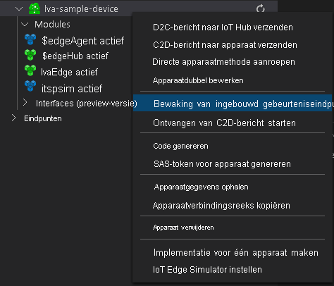

U gaat de module Live Video Analytics in IoT Edge gebruiken om beweging in de inkomende livevideostream te detecteren en gebeurtenissen naar IoT Hub te verzenden. Volg deze stappen om deze gebeurtenissen te bekijken:

1. Open het deelvenster Explorer in Visual Studio Code en zoek Azure IoT Hub in de linkerbenedenhoek.
1. Vouw het knooppunt **Apparaten** uit.
1. Klik met de rechtermuisknop op **Iva-sample-device** en selecteer **Bewaking van ingebouwd gebeurteniseindpunt starten**.

    

> [!NOTE]
> Mogelijk wordt u gevraagd om ingebouwde eindpunt gegevens voor de IoT Hub op te geven. Als u deze informatie wilt ophalen, gaat u in Azure Portal naar uw IoT Hub en zoekt u naar de optie **ingebouwde eind punten** in het navigatie deel venster links. Klik op deze en zoek naar het **eind punt Event hub** onder **Event hub-compatibel eind punt** . Kopieer en gebruik de tekst in het vak. Het eind punt ziet er ongeveer als volgt uit:  
    ```
    Endpoint=sb://iothub-ns-xxx.servicebus.windows.net/;SharedAccessKeyName=iothubowner;SharedAccessKey=XXX;EntityPath=<IoT Hub name>
    ```
