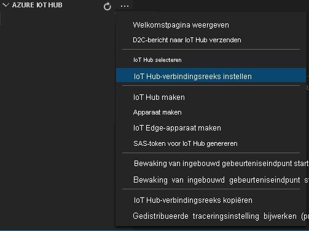
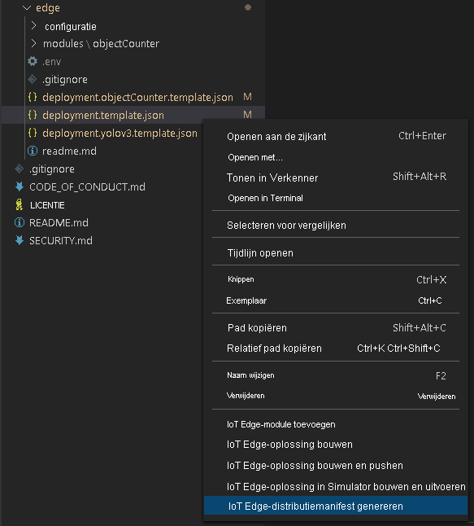
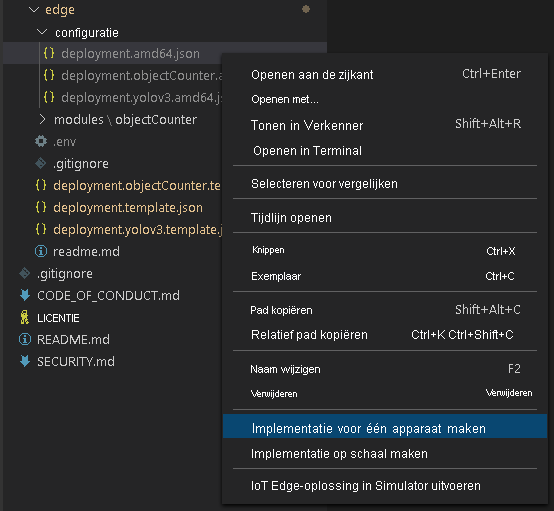

Het implementatiemanifest geeft aan welke modules op een edge-apparaat worden geïmplementeerd. Ook bevat het de configuratie-instellingen voor deze modules. 

Volg deze stappen om het manifest te genereren op basis van het sjabloonbestand en het vervolgens te implementeren op het edge-apparaat.

1. Open Visual Studio Code.
1. Selecteer naast het deelvenster **AZURE IOT HUB** het pictogram **Meer acties** om de IoT Hub-verbindingsreeks in te stellen. U kunt de tekenreeks kopiëren uit het bestand *src/cloud-to-device-console-app/appsettings.json*. 

    

> [!NOTE]
> Mogelijk wordt u gevraagd om ingebouwde eindpunt gegevens voor de IoT Hub op te geven. Als u deze informatie wilt ophalen, gaat u in Azure Portal naar uw IoT Hub en zoekt u naar de optie **ingebouwde eind punten** in het navigatie deel venster links. Klik op deze en zoek naar het **eind punt Event hub** onder **Event hub-compatibel eind punt** . Kopieer en gebruik de tekst in het vak. Het eind punt ziet er ongeveer als volgt uit:  
    ```
    Endpoint=sb://iothub-ns-xxx.servicebus.windows.net/;SharedAccessKeyName=iothubowner;SharedAccessKey=XXX;EntityPath=<IoT Hub name>
    ```

1. Klik met de rechtermuisknop op **src/edge/deployment.template.json** en selecteer **IoT Edge-implementatiemanifest genereren**.

    

    Met deze actie maakt u een manifestbestand met de naam *deployment.amd64.json* in de map *src/edge/config*.
1. Klik met de rechtermuisknop op **src/edge/config/deployment.amd64.json**, selecteer **Implementatie voor één apparaat maken** en selecteer vervolgens de naam van uw edge-apparaat.

    

1. Wanneer u wordt gevraagd om een IoT Hub-apparaat te selecteren, kiest u **lva-sample-device** in de vervolgkeuzelijst.
1. Vernieuw Azure IoT Hub na ongeveer 30 seconden in de linkerbenedenhoek van het venster. Op het edge-apparaat worden nu de volgende geïmplementeerde modules weergegeven:

    * Live Video Analytics in IoT Edge (modulenaam `lvaEdge`)
    * RTSP-simulator (Real-Time Streaming Protocol) (modulenaam `rtspsim`)

In de RTSP-simulatormodule wordt een livevideostream gesimuleerd met behulp van een videobestand dat is gekopieerd naar uw edge-apparaat toen u het [installatiescript voor Live Video Analytics-resources](https://github.com/Azure/live-video-analytics/tree/master/edge/setup) uitvoerde. 

> [!NOTE]
> Als u uw eigen Edge-apparaat gebruikt in plaats van een van de apparaten die via ons installatiescript is ingericht, gaat u naar uw Edge-apparaat en voert u de volgende opdrachten uit met **beheerdersrechten** om het voorbeeld van het videobestand dat voor deze quickstart is gebruikt, op te halen en op te slaan:  

```
mkdir /home/lvaedgeuser/samples      
mkdir /home/lvaedgeuser/samples/input    
curl https://lvamedia.blob.core.windows.net/public/camera-300s.mkv > /home/lvaedgeuser/samples/input/camera-300s.mkv  
chown -R lvalvaedgeuser:localusergroup /home/lvaedgeuser/samples/  
```
In deze fase zijn de modules geïmplementeerd, maar zijn er geen mediagrafen actief.
