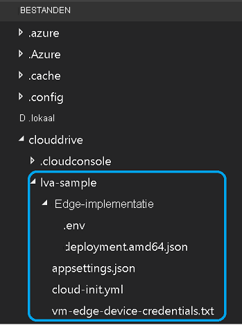

Voor deze zelfstudie hebt u de volgende Azure-resources nodig:

* IoT Hub
* Storage-account
* Azure Media Services-account
* Linux-VM in Azure, met [IoT Edge-runtime](../../../../../iot-edge/how-to-install-iot-edge.md) geïnstalleerd

Voor deze quickstart wordt u aangeraden gebruik te maken van het [installatiescript voor Live Video Analytics-resources](https://github.com/Azure/live-video-analytics/tree/master/edge/setup) om de vereiste Azure-resources in uw Azure-abonnement te implementeren. Voer hiervoor de volgende stappen uit:

1. Open [Azure Cloud Shell](https://ms.portal.azure.com/#cloudshell/).
    > [!div class="mx-imgBorder"]
    > :::image type="content" source="../../../media/quickstarts/cloud-shell.png" alt-text="Cloud Shell":::
1. Als u Cloud Shell voor het eerst gebruikt, wordt u gevraagd een abonnement te selecteren voor het maken van een opslagaccount en een Microsoft Azure-bestandsshare. Selecteer **Opslag maken** om een opslagaccount te maken voor de gegevens van uw Cloud Shell-sessie. Dit opslagaccount is gescheiden van het account dat door het script wordt gemaakt voor gebruik bij uw Azure Media Services-account.
1. Selecteer in de vervolgkeuzelijst aan de linkerkant van het Cloud Shell-venster **Bash** als uw omgeving.

    
1. Voer de volgende opdracht uit.

    ```
    bash -c "$(curl -sL https://aka.ms/lva-edge/setup-resources-for-samples)"
    ```
    
    Als het script is voltooid, ziet u alle vereiste resources in uw abonnement. Er worden in totaal 12 resources door het script ingesteld:
    1. **Streaming-eind punt** : dit helpt bij het afspelen van het opgenomen AMS-activum.
    1. **Virtuele machine** : dit is een virtuele machine die zal fungeren als uw edge-apparaat.
    1. **Schijf** : dit is een opslag schijf die is gekoppeld aan de virtuele machine om media en artefacten op te slaan.
    1. **Netwerk beveiligings groep** : dit wordt gebruikt voor het filteren van netwerk verkeer naar en van Azure-resources in een virtueel Azure-netwerk.
    1. **Netwerk interface** : Hierdoor kan een virtuele machine van Azure communiceren met internet, Azure en andere resources.
    1. **Bastion-verbinding** : Hiermee kunt u verbinding maken met uw virtuele machine met behulp van uw browser en de Azure Portal.
    1. **Openbaar IP-adres** : Hiermee kunnen Azure-resources communiceren met internet en open bare Azure-Services
    1. **Virtueel netwerk** : Hiermee kunnen veel soorten Azure-resources, zoals uw virtuele machine, veilig communiceren met elkaar, het internet en on-premises netwerken. Meer informatie over [virtuele netwerken](../../../../../virtual-network/virtual-networks-overview.md)
    1. **IOT hub** : dit fungeert als een centrale Message hub voor bidirectionele communicatie tussen uw IOT-toepassing, IOT Edge modules en de apparaten die worden beheerd.
    1. **Media service-account** : dit helpt bij het beheren en streamen van media-inhoud in Azure.
    1. **Opslag account** : u moet één primair opslag account hebben en u kunt elk gewenst aantal secundaire opslag accounts aan uw Media Services-account koppelen. Raadpleeg [Azure Storage-accounts met Azure Media Services-accounts](../../../../latest/storage-account-concept.md) voor meer informatie.
    1. **Container Registry** : dit helpt bij het opslaan en beheren van uw persoonlijke docker-container installatie kopieën en gerelateerde artefacten.
1. Als het script is voltooid, selecteert u de accolades om de mapstructuur zichtbaar te maken. Er bevinden zich enkele bestanden in de map *~/clouddrive/lva-sample*. Van belang voor deze quickstart zijn:

     * ***~/clouddrive/lva-sample/edge-deployment/.env***: dit bestand bevat eigenschappen die Visual Studio Code gebruikt om modules te implementeren op een edge-apparaat.
     * ***~/clouddrive/lva-sample/appsetting.json***: dit bestand wordt gebruikt door Visual Studio Code voor het uitvoeren van de voorbeeldcode.
     
    U hebt deze bestanden nodig wanneer u uw ontwikkelomgeving in Visual Studio Code instelt in de volgende sectie. U kunt deze voorlopig in een lokaal bestand kopiëren.
    
    

> [!TIP]
> Als u problemen ondervindt met Azure-resources die worden gemaakt, raadpleegt u onze **[probleemoplossingsgids](../../../troubleshoot-how-to.md#common-error-resolutions)** , waarmee u enkele veelvoorkomende problemen kunt oplossen.