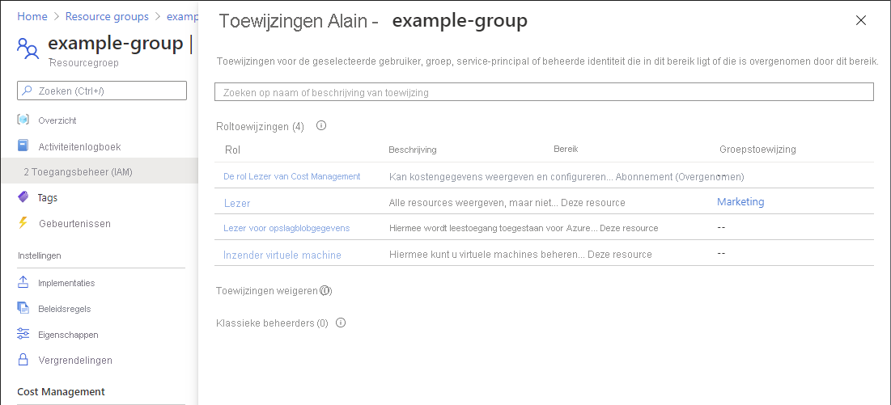

# Azure-roltoewijzingen vermelden met behulp van Azure Portal

[!INCLUDE [Azure RBAC definition list access](../../includes/role-based-access-control/definition-list.md)] In dit artikel wordt beschreven hoe u roltoewijzingen kunt weer geven met behulp van de Azure Portal.

> [!NOTE]
> Als uw organisatie uitbestede beheer functies heeft voor een service provider die gebruikmaakt van [Azure delegated resource management](../lighthouse/concepts/azure-delegated-resource-management.md), worden roltoewijzingen die door die service provider worden toegestaan, hier niet weer gegeven.

## Roltoewijzingen voor een gebruiker of groep weer geven

Een snelle manier om de rollen weer te geven die zijn toegewezen aan een gebruiker of groep in een abonnement is het gebruik van het deel venster **toewijzing van Azure-functie** .

1. Selecteer in het Azure Portal **alle services** in het menu Azure Portal.

1. Selecteer **Azure Active Directory** en selecteer vervolgens **gebruikers** of **groepen**.

1. Klik op de gebruiker of groep waarvoor u de roltoewijzingen wilt weer geven.

1. Klik op **Azure-roltoewijzingen**.

    U ziet een lijst met de rollen die zijn toegewezen aan de geselecteerde gebruiker of groep in verschillende bereiken, zoals de beheer groep, het abonnement, de resource groep of de resource. Deze lijst bevat alle roltoewijzingen waarvoor u lees machtigingen hebt.

        

1. Als u het abonnement wilt wijzigen, klikt u op de lijst **abonnementen** .

## Eigen aren van een abonnement weer geven

Gebruikers aan wie de rol van [eigenaar](built-in-roles.md#owner) voor een abonnement is toegewezen, kunnen alles in het abonnement beheren. Volg deze stappen om de eigen aars van een abonnement weer te geven.

1. Klik in de Azure-portal op de optie **Alle services** en vervolgens op **Abonnementen**.

1. Klik op het abonnement waarvan u de eigen aren wilt vermelden.

1. Klik op **Toegangsbeheer (IAM)** .

1. Klik op het tabblad **Roltoewijzingen** om alle roltoewijzingen voor dit abonnement weer te geven.

1. Ga naar de sectie **eigen aren** om alle gebruikers weer te geven aan wie de rol van eigenaar voor dit abonnement is toegewezen.

   

## Roltoewijzingen in een bereik weer geven

1. Klik in de Azure Portal op **alle services** en selecteer vervolgens het bereik. U kunt bijvoorbeeld **beheer groepen**, **abonnementen**, **resource groepen** of een resource selecteren.

1. Klik op de specifieke resource.

1. Klik op **Toegangsbeheer (IAM)**.

1. Klik op **het tabblad roltoewijzingen om** alle roltoewijzingen in dit bereik weer te geven.

   

   Op het tabblad roltoewijzingen kunt u zien wie toegang heeft tot dit bereik. U ziet dat voor sommige rollen het bereik is ingesteld op **Deze resource**, terwijl andere zijn **(Overgenomen)** uit een ander bereik. De toegang wordt specifiek aan deze resource toegewezen of overgenomen van een toewijzing aan het bovenliggende bereik.

## Roltoewijzingen voor een gebruiker in een bereik weer geven

Als u de toegang wilt weer geven voor een gebruiker, groep, Service-Principal of beheerde identiteit, vermeldt u hun roltoewijzingen. Volg deze stappen om de roltoewijzingen voor één gebruiker, groep, Service-Principal of beheerde identiteit in een bepaald bereik weer te geven.

1. Klik in de Azure Portal op **alle services** en selecteer vervolgens het bereik. U kunt bijvoorbeeld **beheer groepen**, **abonnementen**, **resource groepen** of een resource selecteren.

1. Klik op de specifieke resource.

1. Klik op **Toegangsbeheer (IAM)** .

1. Klik op het tabblad **Toegang controleren**.

    

1. Selecteer in de lijst **zoeken** de gebruikers-, groep-, Service-Principal of beheerde identiteit waarvoor u de toegang wilt controleren.

1. Voer in het zoekvak een tekenreeks in om de map te doorzoeken op weergavenamen, e-mailadressen of object-id's.

    

1. Klik op de beveiligings-principal om het deelvenster **Toewijzingen** te openen.

    In dit deelvenster ziet u de toegang voor de geselecteerde beveiligingsprincipal op dit bereik en de toegang die is overgenomen in dit bereik. Toewijzingen op onderliggende bereiken worden niet vermeld. U ziet de volgende toewijzingen:

    - Roltoewijzingen die zijn toegevoegd met Azure RBAC.
    - Weigeringstoewijzingen die zijn toegevoegd met behulp van Azure Blueprints of beheerde Azure-apps.
    - Toewijzingen voor een Klassieke servicebeheerder of Co-beheerder voor klassieke implementaties. 

    

## Roltoewijzingen voor een beheerde identiteit weer geven

U kunt roltoewijzingen voor door het systeem toegewezen en door de gebruiker toegewezen beheerde identiteiten in een bepaald bereik weer geven met behulp van de Blade **toegangs beheer (IAM)** zoals eerder beschreven. In deze sectie wordt beschreven hoe u roltoewijzingen voor alleen de beheerde identiteit kunt weer geven.

### Door het systeem toegewezen beheerde identiteit

1. Open een door het systeem toegewezen beheerde identiteit in het Azure Portal.

1. Klik in het linkermenu op **identiteit**.

    

1. Klik onder **machtigingen** op **Azure-roltoewijzingen**.

    U ziet een lijst met rollen die zijn toegewezen aan de geselecteerde door het systeem toegewezen beheerde identiteit in verschillende bereiken, zoals beheer groep, abonnement, resource groep of resource. Deze lijst bevat alle roltoewijzingen waarvoor u lees machtigingen hebt.

    

1. Als u het abonnement wilt wijzigen, klikt u op de lijst met **abonnementen** .

### Door de gebruiker toegewezen beheerde identiteit

1. Open een door de gebruiker toegewezen beheerde identiteit in het Azure Portal.

1. Klik op **Azure-roltoewijzingen**.

    U ziet een lijst met rollen die zijn toegewezen aan de geselecteerde door de gebruiker toegewezen beheerde identiteit in verschillende bereiken, zoals beheer groep, abonnement, resource groep of resource. Deze lijst bevat alle roltoewijzingen waarvoor u lees machtigingen hebt.

    

1. Als u het abonnement wilt wijzigen, klikt u op de lijst met **abonnementen** .

## Aantal roltoewijzingen weer geven

U kunt maximaal **2000** roltoewijzingen in elk abonnement hebben. Deze limiet omvat roltoewijzingen voor het abonnement, de resourcegroep en het resourcebereik. Het tabblad roltoewijzingen bevat een grafiek **waarin het aantal** roltoewijzingen voor het huidige abonnement wordt vermeld, zodat u deze limiet kunt bijhouden.

Als u het maximum aantal krijgt en u probeert meer roltoewijzingen toe te voegen, wordt er een waarschuwing weer gegeven in het deel venster **roltoewijzing toevoegen** . Zie [problemen met Azure RBAC oplossen](troubleshooting.md#azure-role-assignments-limit)voor manieren waarop u het aantal roltoewijzingen kunt verlagen.

## Roltoewijzingen downloaden

U kunt roltoewijzingen in een bereik downloaden in CSV-of JSON-indelingen. Dit kan handig zijn als u de lijst in een werk blad wilt inspecteren of een inventarisatie wilt uitvoeren wanneer u een abonnement migreert.

Bij het downloaden van roltoewijzingen moet u rekening gehouden met de volgende criteria:

- Als u geen machtigingen hebt voor het lezen van de Directory, zoals de rol van Directory lezers, zijn de kolommen DisplayName, SignInName en object type leeg.
- Roltoewijzingen waarvan de beveiligingsprincipal is verwijderd, worden niet opgenomen.
- De toegang tot klassieke beheerders wordt niet opgenomen.

Volg deze stappen om roltoewijzingen in een bereik te downloaden.

1. Klik in de Azure Portal op **alle services** en selecteer vervolgens het bereik waar u de roltoewijzingen wilt downloaden. U kunt bijvoorbeeld **beheer groepen**, **abonnementen**, **resource groepen** of een resource selecteren.

1. Klik op de specifieke resource.

1. Klik op **Toegangsbeheer (IAM)**.

1. Klik op Roltoewijzingen **downloaden** om het deel venster roltoewijzingen downloaden te openen.

    

1. Gebruik de selectie vakjes om de roltoewijzingen te selecteren die u wilt toevoegen aan het gedownloade bestand.

    - **Overgenomen** : Neem overgenomen roltoewijzingen op voor het huidige bereik.
    - **Bij Huidig bereik** : roltoewijzingen voor de huidige scope bevatten.
    - **Onderliggende items** : roltoewijzingen op niveaus onder het huidige bereik toevoegen. Dit selectie vakje is uitgeschakeld voor het bereik van de beheer groep.

1. Selecteer de bestands indeling, die door komma's gescheiden waarden (CSV) of JavaScript Object Notation (JSON) kan zijn.

1. Geef de bestands naam op.

1. Klik op **Start** om het downloaden te starten.

    Hieronder ziet u voor beelden van de uitvoer voor elke bestands indeling.

    

    

## Volgende stappen

- [Azure-rollen toewijzen met behulp van de Azure Portal](role-assignments-portal.md)
- [Problemen met Azure RBAC oplossen](troubleshooting.md)
