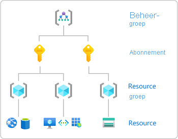

# Azure-rollen toewijzen met behulp van de Azure Portal

[!INCLUDE [Azure RBAC definition grant access](../../includes/role-based-access-control/definition-grant.md)] In dit artikel wordt beschreven hoe u rollen toewijst met behulp van de Azure Portal.

Zie [beheerders rollen weer geven en toewijzen in azure Active Directory](../active-directory/roles/manage-roles-portal.md)als u beheerders rollen wilt toewijzen in azure Active Directory.

## Vereisten

[!INCLUDE [Azure role assignment prerequisites](../../includes/role-based-access-control/prerequisites-role-assignments.md)]

## Stap 1: het benodigde bereik identificeren

[!INCLUDE [Scope for Azure RBAC introduction](../../includes/role-based-access-control/scope-intro.md)]

[!INCLUDE [Scope for Azure RBAC least privilege](../../includes/role-based-access-control/scope-least.md)] Zie [inzicht in bereik](scope-overview.md)voor meer informatie over het bereik.

1. Meld u aan bij [Azure Portal](https://portal.azure.com).

1. Zoek in het zoekvak bovenaan het bereik dat u toegang wilt verlenen. Zoek bijvoorbeeld naar **beheer groepen**, **abonnementen**, **resource groepen** of een specifieke resource.

    

1. Klik op de specifieke resource voor dat bereik.

    Hieronder ziet u een voorbeeld van een resourcegroep.

    

## Stap 2: het deel venster toewijzing van rol toevoegen openen

**Toegangs beheer (IAM)** is de pagina die u doorgaans gebruikt om rollen toe te wijzen om toegang te verlenen tot Azure-resources. Het wordt ook wel ' identiteits-en toegangs beheer (IAM) genoemd en wordt weer gegeven op verschillende locaties in de Azure Portal.

1. Klik op **Toegangsbeheer (IAM)**.

    Hieronder ziet u een voorbeeld van de pagina IAM (Toegangsbeheer) voor een resourcegroep.

    

1. Klik op **het tabblad roltoewijzingen om de roltoewijzingen** in dit bereik weer te geven.

1. Klik **op**  >  **toewijzing van roltoewijzing** toevoegen.
   Als u niet bent gemachtigd voor het toewijzen van rollen, is de optie Roltoewijzing toevoegen uitgeschakeld.

   

    Het deelvenster Roltoewijzing toevoegen wordt geopend.

   

## Stap 3: de juiste rol selecteren

1. Zoek in de lijst met **rollen** de rol die u wilt toewijzen.

    Om u te helpen bij het bepalen van de juiste rol, kunt u de muis aanwijzer boven het info pictogram klikken om een beschrijving voor de rol weer te geven. Zie het artikel [ingebouwde rollen van Azure](built-in-roles.md) voor meer informatie.

   

1. Klik om de rol te selecteren.

## Stap 4: selecteren wie toegang moet hebben

1. Selecteer in de lijst **toegang toewijzen aan** het type beveiligings-principal waaraan u toegang wilt toewijzen.

    | Type | Description |
    | --- | --- |
    | **Gebruiker, groep of Service-Principal** | Als u de rol wilt toewijzen aan een gebruiker, groep of Service-Principal (toepassing), selecteert u dit type. |
    | **Door de gebruiker toegewezen beheerde identiteit** | Als u de rol wilt toewijzen aan een door de [gebruiker toegewezen beheerde identiteit](../active-directory/managed-identities-azure-resources/overview.md), selecteert u dit type. |
    | *Door het systeem toegewezen beheerde identiteit* | Als u de rol wilt toewijzen aan een door het [systeem toegewezen beheerde identiteit](../active-directory/managed-identities-azure-resources/overview.md), selecteert u het exemplaar van de Azure-service waar de beheerde identiteit zich bevindt. |

   

1. Als u een door de gebruiker toegewezen beheerde identiteit of een door het systeem toegewezen beheerde identiteit hebt geselecteerd, selecteert u het **abonnement** waarin de beheerde identiteit zich bevindt.

1. Zoek in de sectie **selecteren** naar de beveiligingsprincipal door een teken reeks in te voeren of door de lijst te bladeren.

   

1. Zodra u de beveiligingsprincipal hebt gevonden, klikt u erop om deze te selecteren.

## Stap 5: rol toewijzen

1. Klik op **Opslaan** om de rol toe te wijzen.

   Na enkele ogen blikken wordt de rol bij de geselecteerde scope toegewezen aan de beveiligingsprincipal.

1. Controleer op **het tabblad roltoewijzingen of de roltoewijzing** in de lijst wordt weer geven.

    

## Volgende stappen

- [Een gebruiker toewijzen als beheerder van een Azure-abonnement](role-assignments-portal-subscription-admin.md)
- [Azure-roltoewijzingen verwijderen](role-assignments-remove.md)
- [Problemen met Azure RBAC oplossen](troubleshooting.md)
