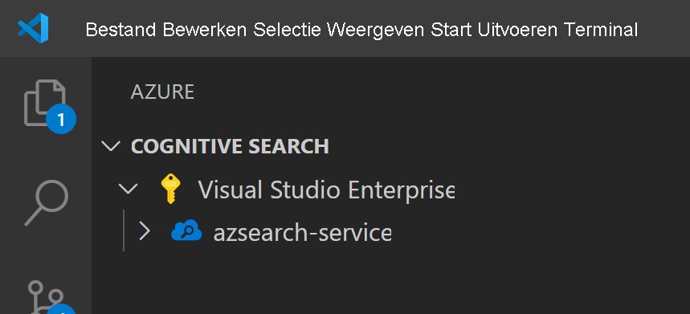
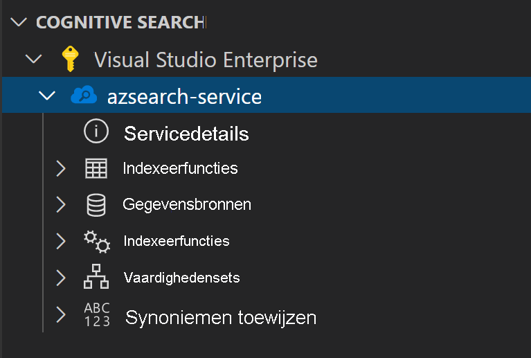
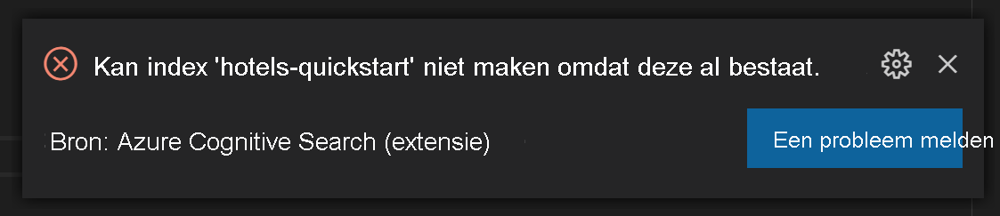
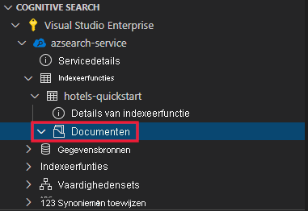
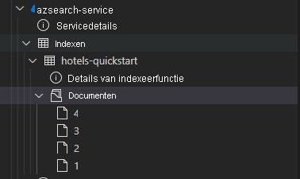
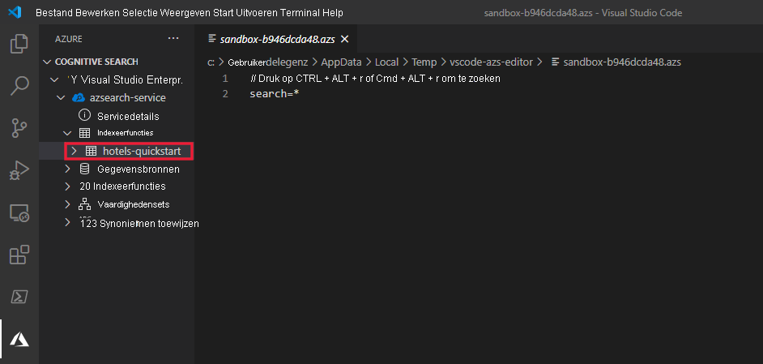

In het artikel wordt gebruikgemaakt van een Visual Studio Code-extensie (preview) voor Azure Cognitive Search REST API's.

> [!IMPORTANT] 
> Deze functie is momenteel beschikbaar als openbare preview-versie. Deze previewfunctie wordt aangeboden zonder service level agreement en wordt niet aanbevolen voor productieworkloads. Zie [Supplemental Terms of Use for Microsoft Azure Previews (Aanvullende gebruiksvoorwaarden voor Microsoft Azure-previews)](https://azure.microsoft.com/support/legal/preview-supplemental-terms/) voor meer informatie. 

## <a name="prerequisites"></a>Vereisten

De volgende services en hulpprogramma's zijn vereist voor deze quickstart. 

+ [Visual Studio Code](https://code.visualstudio.com/download)

+ [Azure Cognitive Search voor Visual Studio Code (preview)](https://marketplace.visualstudio.com/items?itemName=ms-azuretools.vscode-azurecognitivesearch)

+ [Maak een Azure Cognitive Search-service](../search-create-service-portal.md) of [zoek een bestaande service](https://ms.portal.azure.com/#blade/HubsExtension/BrowseResourceBlade/resourceType/Microsoft.Search%2FsearchServices) onder uw huidige abonnement. U kunt een gratis service voor deze quickstart gebruiken. 

## <a name="copy-a-key-and-url"></a>Een sleutel en URL kopiëren

REST-aanroepen hebben voor elke aanvraag de service-URL en een toegangssleutel nodig. Een zoekservice wordt gemaakt met beide, dus als u Azure Cognitive Search aan uw abonnement hebt toegevoegd, volgt u deze stappen om de benodigde informatie op te halen:

1. [Meld u aan bij Azure Portal](https://portal.azure.com/) en haal op de pagina **Overzicht** van uw zoekservice de URL op. Een eindpunt ziet er bijvoorbeeld uit als `https://mydemo.search.windows.net`.

1. Haal onder **Instellingen** > **Sleutels** een beheersleutel op voor volledige rechten op de service. Er zijn twee uitwisselbare beheersleutels die voor bedrijfscontinuïteit worden verstrekt voor het geval u een moet overschakelen. U kunt de primaire of secundaire sleutel gebruiken op aanvragen voor het toevoegen, wijzigen en verwijderen van objecten.


Voor alle aanvragen is een API-sleutel vereist op elke aanvraag die naar uw service wordt verzonden. Met een geldige sleutel stelt u per aanvraag een vertrouwensrelatie in tussen de toepassing die de aanvraag verzendt en de service die de aanvraag afhandelt.

## <a name="install-the-extension"></a>De extensie installeren

Begin met het openen van [VS Code](https://code.visualstudio.com). Selecteer het tabblad **Extensies** op de activiteitenbalk en zoek vervolgens naar *Azure Cognitive Search*. Zoek de extensie bij de zoekresultaten en selecteer **Installeren**.


U kunt de [Azure Cognitive Search-extensie](https://aka.ms/vscode-search) ook installeren vanuit de VS Code-marketplace in een webbrowser.

Er zou nu een nieuw Azure-tabblad moeten worden weergegeven op de activiteitenbalk als dat er nog niet was.


## <a name="connect-to-your-subscription"></a>Verbinding maken met uw abonnement

Selecteer **Aanmelden bij Azure...** en meld u aan bij uw Azure-account.

Uw abonnementen zouden nu moeten worden weergegeven. Selecteer het abonnement om een lijst met de zoekservices in het abonnement weer te geven.



U kunt het aantal abonnementen dat wordt weergegeven, beperken door het opdrachtpalet te openen (Ctrl+Shift+P of Cmd+Shift+P) en te zoeken naar *Azure* of *Abonnementen selecteren*. Er zijn ook opdrachten beschikbaar waarmee u zich bij uw Azure-account kunt aan- en afmelden.

Wanneer u de zoekservice uitbreidt, ziet u structuuritems voor elk van de Cognitive Search-resources: indexen, gegevensbronnen, indexeerfuncties, vaardighedensets en synoniemkaarten.



Deze structuuritems kunnen worden uitgebreid om alle eventuele resources weer te geven die u in uw zoekservice hebt

## <a name="1---create-an-index"></a>1 - Een index maken

Voordat u aan de slag kunt met Azure Cognitive Search, moet u eerst een zoekindex maken. Dit gebeurt met de [REST API Index maken](/rest/api/searchservice/create-index). 

Met de VS Code-extensie hoeft u alleen maar na te denken over de hoofdtekst van de aanvraag. Voor deze quickstart geven we een voorbeeld van een indexdefinitie en de bijbehorende documenten.

### <a name="index-definition"></a>Indexdefinitie

De onderstaande indexdefinitie is een voorbeeld van een schema voor fictieve hotels.

Met de verzameling `fields` wordt de structuur van documenten in de zoekindex gedefinieerd. Elk veld heeft een gegevenstype en een aantal extra kenmerken die bepalen hoe het veld kan worden gebruikt.

```json
{
    "name": "hotels-quickstart",
    "fields": [
        {
            "name": "HotelId",
            "type": "Edm.String",
            "key": true,
            "filterable": true
        },
        {
            "name": "HotelName",
            "type": "Edm.String",
            "searchable": true,
            "filterable": false,
            "sortable": true,
            "facetable": false
        },
        {
            "name": "Description",
            "type": "Edm.String",
            "searchable": true,
            "filterable": false,
            "sortable": false,
            "facetable": false,
            "analyzer": "en.lucene"
        },
        {
            "name": "Description_fr",
            "type": "Edm.String",
            "searchable": true,
            "filterable": false,
            "sortable": false,
            "facetable": false,
            "analyzer": "fr.lucene"
        },
        {
            "name": "Category",
            "type": "Edm.String",
            "searchable": true,
            "filterable": true,
            "sortable": true,
            "facetable": true
        },
        {
            "name": "Tags",
            "type": "Collection(Edm.String)",
            "searchable": true,
            "filterable": true,
            "sortable": false,
            "facetable": true
        },
        {
            "name": "ParkingIncluded",
            "type": "Edm.Boolean",
            "filterable": true,
            "sortable": true,
            "facetable": true
        },
        {
            "name": "LastRenovationDate",
            "type": "Edm.DateTimeOffset",
            "filterable": true,
            "sortable": true,
            "facetable": true
        },
        {
            "name": "Rating",
            "type": "Edm.Double",
            "filterable": true,
            "sortable": true,
            "facetable": true
        },
        {
            "name": "Address",
            "type": "Edm.ComplexType",
            "fields": [
                {
                    "name": "StreetAddress",
                    "type": "Edm.String",
                    "filterable": false,
                    "sortable": false,
                    "facetable": false,
                    "searchable": true
                },
                {
                    "name": "City",
                    "type": "Edm.String",
                    "searchable": true,
                    "filterable": true,
                    "sortable": true,
                    "facetable": true
                },
                {
                    "name": "StateProvince",
                    "type": "Edm.String",
                    "searchable": true,
                    "filterable": true,
                    "sortable": true,
                    "facetable": true
                },
                {
                    "name": "PostalCode",
                    "type": "Edm.String",
                    "searchable": true,
                    "filterable": true,
                    "sortable": true,
                    "facetable": true
                },
                {
                    "name": "Country",
                    "type": "Edm.String",
                    "searchable": true,
                    "filterable": true,
                    "sortable": true,
                    "facetable": true
                }
            ]
        }
    ],
    "suggesters": [
        {
            "name": "sg",
            "searchMode": "analyzingInfixMatching",
            "sourceFields": [
                "HotelName"
            ]
        }
    ]
}
```

Als u een nieuwe index wilt maken, klikt u met de rechtermuisknop op **Indexen** en selecteert u vervolgens **Nieuwe index maken**. Een editor met een naam die lijkt op `indexes-new-28c972f661.azsindex` wordt geopend. 

Plak de indexdefinitie van hierboven in het venster. Sla het bestand op en selecteer **Uploaden** wanneer u wordt gevraagd of u de index wilt bijwerken. Nu wordt de index gemaakt en beschikbaar gemaakt in de structuurweergave.


Als er een probleem is met de indexdefinitie, wordt er een foutbericht weergegeven met een uitleg van de fout.



Als dit gebeurt, lost u het probleem op en slaat u het bestand opnieuw op.

## <a name="2---load-documents"></a>2 - Documenten laden

De index maken en de index vullen zijn afzonderlijke stappen. In Azure Cognitive Search bevat de index alle doorzoekbare gegevens. In dit scenario worden de gegevens als JSON-documenten verstrekt. De [REST API voor documenten toevoegen, bijwerken of verwijderen](/rest/api/searchservice/addupdate-or-delete-documents) wordt voor deze taak gebruikt. 

Nieuwe documenten toevoegen in VS Code:

1. Vouw de index `hotels-quickstart` uit die u hebt gemaakt. Klik met de rechtermuisknop op **Documenten** en selecteer **Nieuw document maken**.

    

2. Hiermee opent u een JSON-editor die het schema van uw index heeft afgeleid.

    

3. Plak de onderstaande JSON en sla het bestand op. Er wordt een prompt geopend waarin u wordt gevraagd om uw wijzigingen te bevestigen. Selecteer **Uploaden** om de wijzigingen op te slaan.

    ```json
    {
        "HotelId": "1",
        "HotelName": "Secret Point Motel",
        "Description": "The hotel is ideally located on the main commercial artery of the city in the heart of New York. A few minutes away is Time's Square and the historic centre of the city, as well as other places of interest that make New York one of America's most attractive and cosmopolitan cities.",
        "Category": "Boutique",
        "Tags": [ "pool", "air conditioning", "concierge" ],
        "ParkingIncluded": false,
        "LastRenovationDate": "1970-01-18T00:00:00Z",
        "Rating": 3.60,
        "Address": {
            "StreetAddress": "677 5th Ave",
            "City": "New York",
            "StateProvince": "NY",
            "PostalCode": "10022",
            "Country": "USA"
        } 
    }
    ```

4. Herhaal dit proces voor de drie resterende documenten

    Document 2:
    ```json
    {
        "HotelId": "2",
        "HotelName": "Twin Dome Motel",
        "Description": "The hotel is situated in a  nineteenth century plaza, which has been expanded and renovated to the highest architectural standards to create a modern, functional and first-class hotel in which art and unique historical elements coexist with the most modern comforts.",
        "Category": "Boutique",
        "Tags": [ "pool", "free wifi", "concierge" ],
        "ParkingIncluded": false,
        "LastRenovationDate": "1979-02-18T00:00:00Z",
        "Rating": 3.60,
        "Address": {
            "StreetAddress": "140 University Town Center Dr",
            "City": "Sarasota",
            "StateProvince": "FL",
            "PostalCode": "34243",
            "Country": "USA"
        } 
    }
    ```

    Document 3:
    ```json
    {
        "HotelId": "3",
        "HotelName": "Triple Landscape Hotel",
        "Description": "The Hotel stands out for its gastronomic excellence under the management of William Dough, who advises on and oversees all of the Hotel’s restaurant services.",
        "Category": "Resort and Spa",
        "Tags": [ "air conditioning", "bar", "continental breakfast" ],
        "ParkingIncluded": true,
        "LastRenovationDate": "2015-09-20T00:00:00Z",
        "Rating": 4.80,
        "Address": {
            "StreetAddress": "3393 Peachtree Rd",
            "City": "Atlanta",
            "StateProvince": "GA",
            "PostalCode": "30326",
            "Country": "USA"
        } 
    }
    ```

    Document 4:
    ```json
    {
        "HotelId": "4",
        "HotelName": "Sublime Cliff Hotel",
        "Description": "Sublime Cliff Hotel is located in the heart of the historic center of Sublime in an extremely vibrant and lively area within short walking distance to the sites and landmarks of the city and is surrounded by the extraordinary beauty of churches, buildings, shops and monuments. Sublime Cliff is part of a lovingly restored 1800 palace.",
        "Category": "Boutique",
        "Tags": [ "concierge", "view", "24-hour front desk service" ],
        "ParkingIncluded": true,
        "LastRenovationDate": "1960-02-06T00:00:00Z",
        "Rating": 4.60,
        "Address": {
            "StreetAddress": "7400 San Pedro Ave",
            "City": "San Antonio",
            "StateProvince": "TX",
            "PostalCode": "78216",
            "Country": "USA"
        }
    }
    ```

U ziet nu alle vier de documenten die in de documentsectie beschikbaar zijn.



## <a name="3---search-an-index"></a>3 - Een index doorzoeken

Nu de index en de documentenset zijn geladen, kunt u hier query's op uitvoeren met behulp van de [REST API documenten doorzoeken](/rest/api/searchservice/search-documents).

In VS Code gaat dat als volgt:

1. Klik met de rechtermuisknop op de index die u wilt doorzoeken en selecteer **Index doorzoeken**. Er wordt nu een editor geopend met een naam die lijkt op `sandbox-b946dcda48.azs`.

    

2. Er wordt automatisch een eenvoudige query ingevuld. Druk op **Ctrl+Alt+R** of **Cmd+Alt+R** om de query in te dienen. De resultaten worden in een venster aan de linkerkant weergegeven.

    


### <a name="example-queries"></a>Voorbeelden van query's

Probeer een paar andere queryvoorbeelden uit om een idee te krijgen van de syntaxis. Hieronder vindt u vier extra query's die u kunt uitproberen. U kunt meerdere query's aan dezelfde editor toevoegen. Wanneer u op **Ctrl+Alt+R** of **Cmd+Att+R** drukt, bepaalt de regel waarop de cursor staat welke query wordt verzonden.


Met de eerste query zoeken we alleen in bepaalde velden naar `boutique` en `select`. Het is een best practice om alleen de velden te `select` die u nodig hebt, omdat het ophalen van overbodige gegevens een latentie kan veroorzaken bij uw query's. Met de query wordt ook `$count=true` ingesteld, zodat samen met de zoekresultaten ook het totale aantal resultaten wordt geretourneerd.

```
// Query example 1 - Search `boutique` with select and return count
search=boutique&$count=true&$select=HotelId,HotelName,Rating,Category
```

In de volgende query geven we de zoekterm `wifi` op en nemen we ook een filter op om alleen resultaten te retourneren waarvan de status gelijk is aan `'FL'`. Resultaten worden ook gerangschikt op de `Rating`van het hotel.

```
// Query example 2 - Search with filter, orderBy, select, and count
search=wifi&$filter=Address/StateProvince eq 'FL'&$select=HotelId,HotelName,Rating&$orderby=Rating desc
```

Vervolgens kan de zoekopdracht worden beperkt tot één doorzoekbaar veld met behulp van de parameter `searchFields`. Dit is een uitstekende optie om uw query efficiënter te maken als u weet dat u alleen geïnteresseerd bent in overeenkomende resultaten in bepaalde velden.

```
// Query example 3 - Limit searchFields
search=submlime cliff&$select=HotelId,HotelName,Rating&searchFields=HotelName
```

Een andere veelgebruikte optie die in een query moet worden opgenomen, is `facets`. Met facetten kunt u filters maken op uw gebruikersinterface, zodat gebruikers eenvoudig kunnen zien welke waarden ze kunnen filteren.

```
// Query example 4 - Take the top two results, and show only HotelName and Category in the results
search=*&$select=HotelId,HotelName,Rating&searchFields=HotelName&facet=Category
```

## <a name="open-index-in-the-portal"></a>Index openen in de portal

Als u uw zoekservice in de portal wilt bekijken, klikt u met de rechtermuisknop op de naam van de zoekservice en selecteert u **Openen in portal**. U gaat dan naar de zoekservice in Azure Portal.