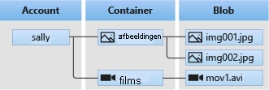

# <a name="quickstart-azure-blob-storage-client-library-v12-for-net"></a>Quickstart: Azure Blob Storage clientbibliotheek v12 voor .NET

Ga aan de slag met Azure Blob Storage clientbibliotheek v12 voor .NET. Azure Blob Storage is de oplossing voor opslag van objecten in de cloud van Microsoft. Volg de stappen om het pakket te installeren en voorbeeldcode voor basistaken uit te proberen. Blob Storage is geoptimaliseerd voor het opslaan van grote hoeveelheden ongestructureerde gegevens.

Gebruik de Azure Blob Storage-clientbibliotheek v12 voor .NET voor het volgende:

* Een container maken
* Een blob uploaden naar Azure Storage
* Alle blobs in een container weergeven
* De blob downloaden op uw lokale computer
* Een container verwijderen

Aanvullende bronnen:

* [API-referentiedocumentatie](/dotnet/api/azure.storage.blobs)
* [Broncode van bibliotheek](https://github.com/Azure/azure-sdk-for-net/tree/master/sdk/storage/Azure.Storage.Blobs)
* [Pakket (NuGet)](https://www.nuget.org/packages/Azure.Storage.Blobs)
* [Voorbeelden](../common/storage-samples-dotnet.md?toc=%2fazure%2fstorage%2fblobs%2ftoc.json#blob-samples)

[!INCLUDE [storage-multi-protocol-access-preview](../../../includes/storage-multi-protocol-access-preview.md)]

## <a name="prerequisites"></a>Vereisten

* Azure-abonnement: [u kunt een gratis abonnement nemen](https://azure.microsoft.com/free/)
* Azure Storage-account: [maak een opslagaccount](../common/storage-account-create.md)
* De huidige versie van de [.NET Core SDK](https://dotnet.microsoft.com/download/dotnet-core) voor uw besturingssysteem. Zorg ervoor dat u de SDK en niet de runtime ophaalt.

## <a name="setting-up"></a>Instellen

In deze sectie wordt u door het voorbereiden van een project voor de Azure Blob Storage clientbibliotheek v12 voor .NET.

### <a name="create-the-project"></a>Het project maken

Maak een .NET Core-toepassing met de naam *BlobQuickstartV12*.

1. Gebruik in een consolevenster (zoals cmd, PowerShell of Bash) de opdracht `dotnet new` om een nieuwe console-app te maken met de naam *BlobQuickstartV12*. Met deze opdracht maakt u een eenvoudig Hallo wereld-C#-project met één bronbestand: *Program.cs*.

   ```console
   dotnet new console -n BlobQuickstartV12
   ```

1. Schakel over naar de zojuist gemaakte map *BlobQuickstartV12*.

   ```console
   cd BlobQuickstartV12
   ```

1. Maak een andere map met de naam *gegevens* in de map *BlobQuickstartV12*. Hier worden de blob-gegevensbestanden gemaakt en opgeslagen.

    ```console
    mkdir data
    ```

### <a name="install-the-package"></a>Het pakket installeren

Blijf in de toepassingsmap en installeer de Azure Blob Storage-clientbibliotheek voor het .NET-pakket met behulp van de opdracht `dotnet add package`.

```console
dotnet add package Azure.Storage.Blobs
```

### <a name="set-up-the-app-framework"></a>Het app-framework instellen

Ga als volgt te werk vanuit de projectmap:

1. Open het *bestand Program.cs* in uw editor.
1. Verwijder de `Console.WriteLine("Hello World!");` instructie .
1. Voeg `using` -instructies toe.
1. Werk de `Main` methodedeclaratie bij om async te ondersteunen.

    Hier volgt de code:

    :::code language="csharp" source="~/azure-storage-snippets/blobs/quickstarts/dotnet/BlobQuickstartV12/app_framework.cs":::

[!INCLUDE [storage-quickstart-credentials-include](../../../includes/storage-quickstart-credentials-include.md)]

## <a name="object-model"></a>Objectmodel

Azure Blob Storage is geoptimaliseerd voor het opslaan van grote hoeveelheden ongestructureerde gegevens. Ongestructureerde gegevens zijn gegevens die niet voldoen aan een bepaald gegevensmodel of bepaalde definitie, zoals tekst of binaire gegevens. Er zijn drie typen resources voor blobopslag:

* Het opslagaccount
* Een container in het opslagaccount
* Een blob in de container

Het volgende diagram geeft de relatie tussen deze resources weer.



Gebruik de volgende .NET-klassen om te communiceren met deze resources:

* [BlobServiceClient](/dotnet/api/azure.storage.blobs.blobserviceclient): Met de klasse `BlobServiceClient` kunt u Azure Storage-resources en blob-containers bewerken.
* [BlobContainerClient](/dotnet/api/azure.storage.blobs.blobcontainerclient): Met de klasse `BlobContainerClient` kunt u Azure Storage-containers en de bijbehorende blobs bewerken.
* [BlobClient](/dotnet/api/azure.storage.blobs.blobclient): Met de klasse `BlobClient` kunt u Azure Storage-blobs bewerken.
* [BlobDownloadInfo](/dotnet/api/azure.storage.blobs.models.blobdownloadinfo): De klasse `BlobDownloadInfo` vertegenwoordigt de eigenschappen en inhoud die worden geretourneerd door het downloaden van een blob.

## <a name="code-examples"></a>Codevoorbeelden

Deze voorbeeldcodefragmenten laten zien hoe u het volgende kunt uitvoeren met de Azure Blob Storage-clientbibliotheek voor .NET:

* [De verbindingsreeks ophalen](#get-the-connection-string)
* [Een container maken](#create-a-container)
* [Blobs uploaden naar een container](#upload-blobs-to-a-container)
* [De blobs in een container weergeven](#list-the-blobs-in-a-container)
* [Blobs downloaden](#download-blobs)
* [Container verwijderen](#delete-a-container)

### <a name="get-the-connection-string"></a>De verbindingsreeks ophalen

De onderstaande code haalt de verbindingstekenreeks voor het opslagaccount op van de omgevingsvariabele die is gemaakt in de sectie [De opslagverbindingsreeks configureren](#configure-your-storage-connection-string).

Voeg deze code toe in de methode `Main`:

:::code language="csharp" source="~/azure-storage-snippets/blobs/quickstarts/dotnet/BlobQuickstartV12/Program.cs" id="Snippet_ConnectionString":::

### <a name="create-a-container"></a>Een container maken

Verzin een naam voor de nieuwe container. Met de onderstaande code wordt een GUID-waarde aan de containernaam toegevoegd om te verzekeren dat deze uniek is.

> [!IMPORTANT]
> Containernamen moeten uit kleine letters bestaan. Zie [Containers, blobs en metagegevens een naam geven en hiernaar verwijderen](/rest/api/storageservices/naming-and-referencing-containers--blobs--and-metadata) voor meer informatie over de naamgeving van containers en blobs.

Een instantie van de klasse [BlobServiceClient](/dotnet/api/azure.storage.blobs.blobserviceclient) maken. Roep vervolgens de methode [CreateBlobContainerAsync](/dotnet/api/azure.storage.blobs.blobserviceclient.createblobcontainerasync) aan om de container in uw opslagaccount te maken.

Voeg deze code toe aan het einde van de `Main`-methode:

:::code language="csharp" source="~/azure-storage-snippets/blobs/quickstarts/dotnet/BlobQuickstartV12/Program.cs" id="Snippet_CreateContainer":::

### <a name="upload-blobs-to-a-container"></a>Blobs uploaden naar een container

Het volgende codefragment:

1. Hiermee maakt u een tekstbestand in de lokale map *gegevens*.
1. Hiermee wordt een verwijzing naar een [BlobClient](/dotnet/api/azure.storage.blobs.blobclient)-object opgehaald door de methode [GetBlobClient](/dotnet/api/azure.storage.blobs.blobcontainerclient.getblobclient) aan te roepen voor de container vanuit de sectie [Een container maken](#create-a-container).
1. Hiermee wordt het lokale tekstbestand geüpload naar de blob door de methode [UploadAsync](/dotnet/api/azure.storage.blobs.blobclient.uploadasync#Azure_Storage_Blobs_BlobClient_UploadAsync_System_IO_Stream_System_Boolean_System_Threading_CancellationToken_) aan te roepen. Met deze methode wordt de blob gemaakt als deze nog niet bestaat, of overschreven als dat wel het geval is.

Voeg deze code toe aan het einde van de `Main`-methode:

:::code language="csharp" source="~/azure-storage-snippets/blobs/quickstarts/dotnet/BlobQuickstartV12/Program.cs" id="Snippet_UploadBlobs":::

### <a name="list-the-blobs-in-a-container"></a>De blobs in een container in een lijst weergeven

Hiermee worden de blobs in de container weergegeven door de methode [GetBlobsAsync](/dotnet/api/azure.storage.blobs.blobcontainerclient.getblobsasync) aan te roepen. In dit geval is slechts één blob aan de container toegevoegd, zodat met de weergavebewerking alleen die ene blob wordt geretourneerd.

Voeg deze code toe aan het einde van de `Main`-methode:

:::code language="csharp" source="~/azure-storage-snippets/blobs/quickstarts/dotnet/BlobQuickstartV12/Program.cs" id="Snippet_ListBlobs":::

### <a name="download-blobs"></a>Blobs downloaden

Download de eerder gemaakte blob door de methode [DownloadAsync](/dotnet/api/azure.storage.blobs.specialized.blobbaseclient.downloadtoasync) aan te roepen. Met de voorbeeldcode wordt het achtervoegsel 'DOWNLOADED' toegevoegd aan de naam van het bestand, zodat u beide bestanden in het lokale bestandssysteem kunt zien.

Voeg deze code toe aan het einde van de `Main`-methode:

:::code language="csharp" source="~/azure-storage-snippets/blobs/quickstarts/dotnet/BlobQuickstartV12/Program.cs" id="Snippet_DownloadBlobs":::

### <a name="delete-a-container"></a>Een container verwijderen

Met de volgende code worden de resources opgeruimd die door de app zijn gemaakt door de hele container te verwijderen met behulp van [DeleteAsync](/dotnet/api/azure.storage.blobs.blobcontainerclient.deleteasync). Ook worden de lokale bestanden verwijderd die door de app zijn gemaakt.

De app pauzeert voor gebruikersinvoer door `Console.ReadLine` aan te roepen voordat deze de blob, container en lokale bestanden verwijdert. Dit is een goede gelegenheid om te controleren of de resources daadwerkelijk correct zijn gemaakt, voordat ze worden verwijderd.

Voeg deze code toe aan het einde van de `Main`-methode:

:::code language="csharp" source="~/azure-storage-snippets/blobs/quickstarts/dotnet/BlobQuickstartV12/Program.cs" id="Snippet_DeleteContainer":::

## <a name="run-the-code"></a>De code uitvoeren

Met deze app wordt een testbestand gemaakt in uw lokale map *gegevens* en geüpload naar de Blob-opslag. Vervolgens wordt een lijst gemaakt van de blobs in de container en wordt het bestand gedownload met een nieuwe naam, zodat u het oude en nieuwe bestand kunt vergelijken.

Navigeer naar de toepassingsmap, bouw de toepassing en voer deze uit.

```console
dotnet build
```

```console
dotnet run
```

De uitvoer van de app lijkt op die in het volgende voorbeeld:

```output
Azure Blob Storage v12 - .NET quickstart sample

Uploading to Blob storage as blob:
         https://mystorageacct.blob.core.windows.net/quickstartblobs60c70d78-8d93-43ae-954d-8322058cfd64/quickstart2fe6c5b4-7918-46cb-96f4-8c4c5cb2fd31.txt

Listing blobs...
        quickstart2fe6c5b4-7918-46cb-96f4-8c4c5cb2fd31.txt

Downloading blob to
        ./data/quickstart2fe6c5b4-7918-46cb-96f4-8c4c5cb2fd31DOWNLOADED.txt

Press any key to begin clean up
Deleting blob container...
Deleting the local source and downloaded files...
Done
```

Voordat u begint met opschonen, controleert u of de twee bestanden zich in de map *gegevens* bevinden. Als u ze opent, ziet u dat ze identiek zijn.

Nadat u de bestanden hebt gecontroleerd, drukt u op **Enter** om de testbestanden te verwijderen en het voorbeeld te voltooien.

## <a name="next-steps"></a>Volgende stappen

In deze snelstart hebt u geleerd hoe u blobs kunt uploaden, downloaden en er een lijst van maken met behulp van .NET.

Als u voorbeeld-apps voor Blob-opslag wilt zien, ga dan naar:

> [!div class="nextstepaction"]
> [Azure Blob Storage SDK v12 .NET-voorbeelden](https://github.com/Azure/azure-sdk-for-net/tree/master/sdk/storage/Azure.Storage.Blobs/samples)

* Ga naar [Azure voor .NET- en .NET Core-ontwikkelaars](/dotnet/azure/) voor zelfstudies, voorbeelden, quickstarts en andere documentatie.
* Zie voor meer informatie over .NET Core [Aan de slag met .NET in 10 minuten](https://dotnet.microsoft.com/learn/dotnet/hello-world-tutorial/intro).
