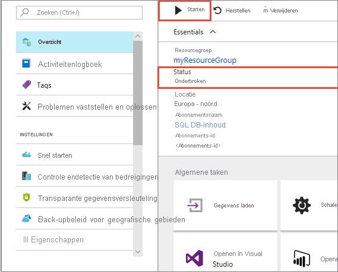
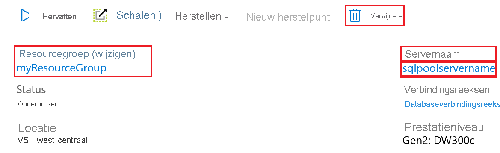

# Quickstart: Berekening in een toegewezen SQL-pool onderbreken en hervatten via de Azure-portal

U kunt de Azure-portal gebruiken om de rekenresources in een toegewezen SQL-pool te onderbreken en weer te hervatten. Als u nog geen Azure-abonnement hebt, maakt u een [gratis account](https://azure.microsoft.com/free/) voordat u begint.

## Aanmelden bij Azure Portal

Meld u aan bij de [Azure-portal](https://portal.azure.com/).

## Voordat u begint

Gebruik [Maken en koppelen - portal](../quickstart-create-sql-pool-portal.md) om een toegewezen SQL-pool met de naam **mySampleDataWarehouse** te maken. 

## Berekening onderbreken

Als u kosten wilt besparen, kunt u de rekenresources op aanvraag onderbreken en hervatten. Als u de database bijvoorbeeld ‘s nachts en in het weekend niet gebruikt, kunt u deze dan onderbreken en gedurende de dag hervatten.
 
>[!NOTE]
>Er worden geen kosten in rekening gebracht voor rekenresources terwijl de database is onderbroken. Er worden echter nog wel steeds kosten in rekening gebracht voor opslag. 

Volg deze stappen om een toegewezen SQL-pool te onderbreken:

1. Meld u aan bij de [Azure-portal](https://portal.azure.com/).
2. Ga naar pagina voor uw **toegewezen SQL-pool** om de SQL-pool te openen. 
3. U ziet dat de **Status** is: **Online**.

    

4. Klik op de knop **Onderbreken** als u de toegewezen SQL-pool wilt onderbreken. 
5. Er wordt een bevestigingsvraag weergegeven waarin u wordt gevraagd of u wilt doorgaan. Klik op **Ja**.
6. Wacht even en u ziet dat de **Status** verandert in **Wordt onderbroken**.

    

7. Wanneer de onderbreking is voltooid, verandert de status in **Onderbroken** en verandert de optieknop in **Hervatten**.
8. De rekenresources voor de toegewezen SQL-pool zijn nu offline. Er worden geen kosten in rekening gebracht voor de rekenkracht totdat u de service hervat.

    

## Berekening hervatten

Volg deze stappen om een toegewezen SQL-pool te hervatten.

1. Ga naar pagina voor uw **toegewezen SQL-pool** om de SQL-pool te openen.
3. U ziet op de pagina **mySampleDataWarehouse** dat de **Status** **Onderbroken** is.

    

1. Klik op **Hervatten** om de SQL-pool te hervatten. 
1. Er wordt een bevestigingsvraag weergegeven waarin u wordt gevraagd of u wilt starten. Klik op **Ja**.
1. U ziet dat de **Status** **Hervatten** weergeeft.

    

1. Wanneer de SQL-pool weer online is, is de status **Online** en verandert de keuzeknop in **Onderbreken**.
1. De rekenresources voor de SQL-pool zijn nu online en u kunt de service gebruiken. De kosten voor de rekenkracht zijn hervat.

    

## Resources opschonen

Er worden kosten in rekening gebracht voor datawarehouse-eenheden en de gegevens die zijn opgeslagen in uw toegewezen SQL-pool. Deze compute- en opslagresources worden apart in rekening gebracht. 

- Als u de gegevens in de opslag wilt houden, moet u het berekenen onderbreken.
- Als u in de toekomst geen kosten meer wilt maken, kunt u de toegewezen SQL-pool verwijderen. 

Volg deze stappen om de resources op te schonen zoals gewenst.

1. Meld u aan bij [Azure Portal](https://portal.azure.com) en selecteer uw toegewezen SQL-pool.

    

1. Als u het berekenen wilt onderbreken, klikt u op de knop **Onderbreken**. 

1. Als u de toegewezen SQL-pool wilt verwijderen zodat er geen kosten in rekening worden gebracht voor berekenen of opslaan, klikt u op **Verwijderen**.

## Volgende stappen

U hebt nu de berekening voor uw toegewezen SQL-pool gepauzeerd en hervat. Ga naar het volgende artikel voor meer informatie over [Gegevens in een toegewezen SQL-pool laden](./load-data-from-azure-blob-storage-using-copy.md). Zie het artikel [Overzicht rekencapaciteit beheren](sql-data-warehouse-manage-compute-overview.md) voor meer informatie over het beheren van rekencapaciteit.
