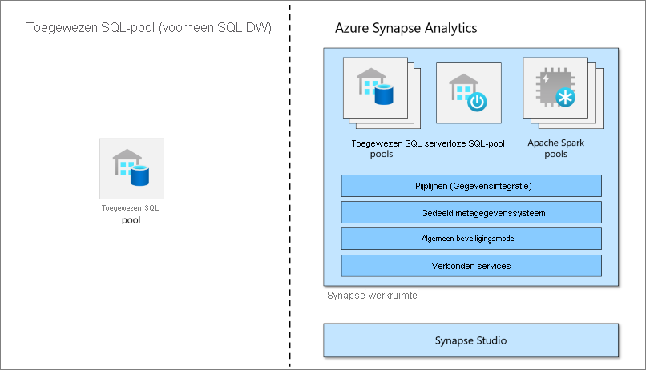

# Wat is een toegewezen SQL-pool (voorheen SQL DW) in Azure Synapse Analytics?

Azure Synapse Analytics is een analyseservice die datawarehousing voor ondernemingen en big data-analyses combineert. Toegewezen SQL-pool (voorheen SQL DW) verwijst naar de functies voor datawarehousing voor ondernemingen, die beschikbaar zijn in Azure Synapse Analytics.

Toegewezen SQL-pool (voorheen SQL DW) vertegenwoordigt een verzameling analytische resources die worden ingericht tijdens het gebruik van Synapse SQL. De grootte van een toegewezen SQL-pool (voorheen SQL DW) wordt bepaald door DWU’s (Data Warehousing Unit).

Zodra uw toegewezen SQL-pool is gemaakt, kunt u big data met eenvoudige [PolyBase](/sql/relational-databases/polybase/polybase-guide?toc=/azure/synapse-analytics/sql-data-warehouse/toc.json&bc=/azure/synapse-analytics/sql-data-warehouse/breadcrumb/toc.json&view=azure-sqldw-latest&preserve-view=true) T-SQL-query's importeren en vervolgens de kracht van de gedistribueerde-queryengine gebruiken om krachtige analyses uit te voeren. Terwijl u de gegevens integreert en analyseert, wordt de toegewezen SQL-pool (voorheen SQL DW) de centrale bron waarop uw bedrijf kan rekenen voor het verkrijgen van snellere en meer robuuste inzichten.

> [!NOTE]
>Verken de [Documentatie voor Azure Synapse Analytics](../overview-what-is.md).
> 

## Belangrijk onderdeel van een big data-oplossing

Datawarehousing is een belangrijk onderdeel van een end-to-end big data-oplossing in de cloud.

In een cloudgegevensoplossing zijn gegevens opgenomen in big data-archieven uit verschillende bronnen. Nadat de gegevens zijn opgenomen in een big data-archief, worden ze met behulp van Hadoop-, Spark- en machine learning-algoritmen voorbereid en getraind. Wanneer de gegevens klaar zijn voor complexe analyse, maakt de toegewezen SQL-pool gebruik van PolyBase om query's uit te voeren op de big data-archieven. PolyBase gebruikt standaard T-SQL-query's om de gegevens op te slaan in de tabellen van de toegewezen SQL-pool (voorheen SQL DW).

In een toegewezen SQL-pool (voorheen SQL DW) worden gegevens opgeslagen in relationele tabellen met opslag in kolommen. Deze indeling beperkt de kosten voor gegevensopslag aanzienlijk en verbetert de prestaties van query's. Wanneer de gegevens zijn opgeslagen, kunt u op grote schaal analyses uitvoeren. Vergeleken met traditionele databasesystemen duurt het analyseren van query's seconden in plaats van minuten, of uren in plaats van dagen.

De analyseresultaten kunnen worden verzonden naar wereldwijde rapportagedatabases of toepassingen. Bedrijfsanalisten kunnen vervolgens inzichten verkrijgen om goed gefundeerde zakelijke beslissingen te maken.

## Volgende stappen

- [Azure Synapse-architectuur](massively-parallel-processing-mpp-architecture.md) verkennen
- Snel [een toegewezen SQL-pool maken](create-data-warehouse-portal.md)
- [Voorbeeldgegevens laden](./load-data-from-azure-blob-storage-using-copy.md).
- [Video's verkennen](https://azure.microsoft.com/documentation/videos/index/?services=sql-data-warehouse)

Of bekijk enkele andere Azure Synapse-resources.

- Zoeken in [Blogs](https://azure.microsoft.com/blog/tag/azure-sql-data-warehouse/)
- [Functieaanvragen](https://feedback.azure.com/forums/307516-sql-data-warehouse) indienen
- [Een ondersteuningsticket maken](sql-data-warehouse-get-started-create-support-ticket.md)
- Zoeken op de [Microsoft Q&A-vragenpagina](/answers/topics/azure-synapse-analytics.html)
- Zoeken in het [Stack Overflow-forum](https://stackoverflow.com/questions/tagged/azure-sqldw)